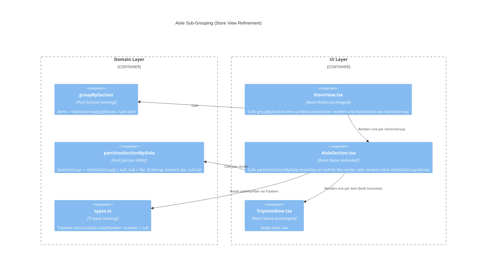

# Architecture Design: Aisle Subgroups in Store View

**Feature ID**: aisle-subgroups-in-store-view
**Date**: 2026-04-27
**Refines**: section-order-by-section (D2)
**Architect**: Morgan (DESIGN wave, PROPOSE mode)
**Scope**: trivial UI refinement + one pure domain helper.

---

## 1. Problem

Inside multi-aisle sections (e.g. `Inner Aisles` containing aisles 4, 5, 7), the store view renders one flat list. Carlos cannot tell mid-shop when he crosses an aisle boundary, and gets no closure cue when an aisle completes. The fix is a sub-grouping inside each section card: divider + numeric badge + per-aisle progress, with collapse rules for single-aisle and all-null sections.

No persistence change. No port change. No new dependencies.

## 2. Reuse Analysis

| Existing artifact | Decision | Rationale |
|---|---|---|
| `groupBySection` (src/domain/item-grouping.ts) | **EXTEND via composition** — keep its signature; add a sibling helper that consumes `SectionGroup` and returns `AisleSubGroup[] \| null` | Single-responsibility preserved. Section-only callers (none today, but possible) keep a clean shape. The two-step pipeline `groupBySection -> partitionSectionByAisle` is the natural composition. |
| `compareItemsInSection` (item-grouping.ts) | **REUSE as-is** | It already encodes aisle-asc + null-last + stable input order. The sub-group ordering can rely on items being pre-sorted by `groupBySection`. The partition becomes a single linear pass over already-sorted items grouping by aisle-equivalence. |
| `SectionGroup` shape `{ section, items, totalCount, checkedCount }` | **MIRROR** in `AisleSubGroup` `{ aisleKey, items, totalCount, checkedCount }` | Identical aggregate semantics → same render code shape for progress + checkmark. |
| `AisleSection.tsx` | **EXTEND in place** | The card frame, header, progress, and section checkmark are unchanged (D-NOREGRESS). A new internal render block handles the sub-group case; the flat path is preserved. No new top-level component. |
| `TripItemRow` | **REUSE as-is** | Item rendering is unchanged. |
| `StoreView.tsx` | **NO CHANGE** | StoreView still passes a `SectionGroup` to `AisleSection`. The partition happens inside `AisleSection`. |

Default-EXTEND verdict satisfied. No new files except the test file for the new helper. **No new top-level component**.

## 3. Chosen Design

### 3.1 New domain helper

```ts
// src/domain/item-grouping.ts (additions)

export type AisleKey = number | null; // null sentinel === "no aisle" tail

export type AisleSubGroup = {
  readonly aisleKey: AisleKey;
  readonly items: TripItem[];
  readonly totalCount: number;
  readonly checkedCount: number;
};

/**
 * Partition the items of a SectionGroup by aisleNumber.
 *
 * Returns:
 *   - null when the section should render flat:
 *       * the section is empty,
 *       * all items share the same aisleKey (single-aisle including all-null).
 *   - AisleSubGroup[] otherwise, ordered numeric-ascending followed by
 *     an optional null-keyed tail bucket. Items inside a sub-group preserve
 *     their input order from the parent SectionGroup.
 *
 * The function is pure. It does not re-sort items beyond bucketing them;
 * groupBySection already produced the aisle-asc/null-last item order.
 */
export const partitionSectionByAisle = (group: SectionGroup): AisleSubGroup[] | null;
```

**Type-safe `null` sentinel**: `AisleKey = number | null` — TypeScript strict-mode discriminates the two cases at use sites without a magic string. Rejected: a `'__no_aisle__'` string sentinel would force consumers (UI badge formatter) to do string comparisons and would not be exhaustive in a `switch`.

**Collapse encoded in the helper**: `null` return — single source of truth for "render flat". UI just checks `partition === null`. Rejected: always returning an array and pushing the collapse decision into the UI duplicates the rule in two layers.

**Order**: numeric buckets ascending (already implied by input order from `groupBySection`), then the `null`-keyed tail bucket (D3). Encoded in the partition function.

**Per-aisle progress**: `checkedCount` and `totalCount` derived inside the partition. UI reads, never recomputes.

### 3.2 UI render branch (in `AisleSection.tsx`)

```ts
// pseudocode
const subGroups = partitionSectionByAisle(sectionGroup);
return (
  <Card testID={`aisle-section-${section}`}>
    <Header>{section} | {checkedCount}/{totalCount} {sectionComplete && <Check/>}</Header>
    {subGroups === null
      ? sectionGroup.items.map(item => <TripItemRow item={item} ... />)
      : subGroups.map(sub => (
          <View testID={`aisle-subgroup-${sub.aisleKey ?? 'no-aisle'}`}>
            <Divider/>
            <Badge>{sub.aisleKey ?? 'No aisle'}</Badge>
            <Progress>{sub.checkedCount}/{sub.totalCount}{sub.checkedCount===sub.totalCount && <Check/>}</Progress>
            {sub.items.map(item => <TripItemRow item={item} ... />)}
          </View>
        ))}
  </Card>
);
```

Section-level header (text, progress, `✓`) is **identical** to today on both branches → D-NOREGRESS satisfied by construction.

### 3.3 Render hierarchy (sketch)

```
StoreView
  └─ AisleSection (one per SectionGroup)
       ├─ Section header  (unchanged: name, X of Y, ✓)
       └─ Body
           ├─ FLAT branch (subGroups === null)
           │     └─ TripItemRow * N
           └─ SUB-GROUPED branch (subGroups: AisleSubGroup[])
                 └─ AisleSubGroup block * M
                       ├─ Divider
                       ├─ Badge ("4" | "5" | "No aisle")
                       ├─ Sub-progress (X of Y, ✓ when complete)
                       └─ TripItemRow * K
```

`AisleSubGroup` is **not** a separate React component file — it is an inline render block inside `AisleSection.tsx`. A separate component would be premature given the block has no reuse target. Decision can be revisited if it grows.

## 4. Edge-Case Matrix

| Case | Items in section | `partitionSectionByAisle` returns | UI renders |
|---|---|---|---|
| Empty section | `[]` | `null` | (section card not produced; not reached) |
| All-null (`Produce`) | aisle: null × N | `null` (single-aisle collapse, key=null) | flat — no divider, no badge |
| Single numeric (`Frozen` aisle 12) | aisle: 12 × N | `null` (single-aisle collapse) | flat — no `12` badge |
| Multi numeric | aisle 4, 5, 7 | 3 sub-groups: `[{4,...},{5,...},{7,...}]` | divider + badge per group, ascending |
| Mixed numeric + null | aisle 4, 5, null | 3 sub-groups: `[{4,...},{5,...},{null,...}]` (null tail) | aisle-4, aisle-5, then `No aisle` tail |
| Numeric + numeric + null tail, all checked | all `checked=true` | each sub-group `checkedCount===totalCount` | each sub-group ✓; section header ✓ |
| One aisle complete, rest not | aisle 4 done; aisle 5 partial | aisle-4 sub-group ✓, aisle-5 sub-group no ✓ | section header partial |

Tie-break and item ordering inside a sub-group: inherited from `groupBySection`'s pre-sort (input order within equal-aisle items). No new sort code introduced — the partition relies on the upstream property "items are aisle-asc + null-last + input-stable."

## 5. C4 Component Diagram (L3) — Touched Code Only



Dependency direction unchanged: UI -> domain. Domain has zero UI imports. `dependency-cruiser` rules continue to hold.

## 6. Test Plan Summary

Unit tests (`src/domain/item-grouping.test.ts`, additions):

- **US-01 AC** "Multi-aisle section card renders one sub-group per distinct `aisleNumber`, ascending":
  partition of a `SectionGroup` with aisles {4,5,7} returns 3 sub-groups in that order.
- **US-01 AC** "All-null section card renders no sub-groups":
  partition of all-null returns `null`.
- **US-01 AC** "Single-aisle section card renders no sub-group":
  partition of single-numeric returns `null`.
- **US-01 AC** "Mixed null + numeric section places the null sub-group at the tail with badge `No aisle`":
  partition of {4, 5, null} returns sub-groups ending in `aisleKey: null`.
- **US-01 AC** "Item input order is preserved inside each aisle sub-group":
  given two items at aisle 4 in input-order [a, b], the aisle-4 sub-group's items === [a, b].
- **US-02 AC** "Each aisle sub-group renders `checkedCount of totalCount` for items within that aisle only":
  sub-group aggregates equal independently computed counts.
- **US-02 AC** "Each aisle sub-group renders `✓` when `checkedCount === totalCount`":
  exercised via aggregate equality (UI render is a derived check; covered by component test).
- **US-02 AC** "Section-level X of Y and ✓ continue to reflect the section as a whole":
  `groupBySection` output unchanged (regression guard); existing tests stay green.
- **US-02 AC** "`No aisle` tail group also reports its own progress + checkmark":
  null-tail sub-group's `checkedCount`/`totalCount` derived correctly.

Component test (`src/ui/AisleSection.test.tsx`, additions): verify flat-branch vs. sub-grouped-branch render via `testID="aisle-subgroup-{aisleKey}"` presence/absence.

Mutation testing scope: `src/domain/item-grouping.ts` already covered by per-feature scope (CLAUDE.md). Threshold ≥80%.

## 7. Architectural Enforcement

Unchanged. `dependency-cruiser` rules already cover:
- `src/domain/**` no imports from `src/adapters/**`, `src/ui/**`, `src/hooks/**`.
- `src/ports/**` no imports from `src/adapters/**`.

The new helper is in `src/domain/item-grouping.ts` — already inside the enforced boundary.

## 8. ADRs Produced

- **ADR-005**: Aisle Sub-Grouping Belongs in the Domain, Composing on `groupBySection`. Rejects UI-side partition and separate-helper-file alternatives.

## 9. Open Issues for DISTILL / DELIVER

- None blocking. UI styling (divider thickness, badge typography, spacing) is delegated to the slice-implementation step — visual tokens already exist in `theme`.
- Component name `AisleSection.tsx` continues to refer to a section card (carry-over naming inconsistency from `section-order-by-section`); intentionally not renamed in this scope.
