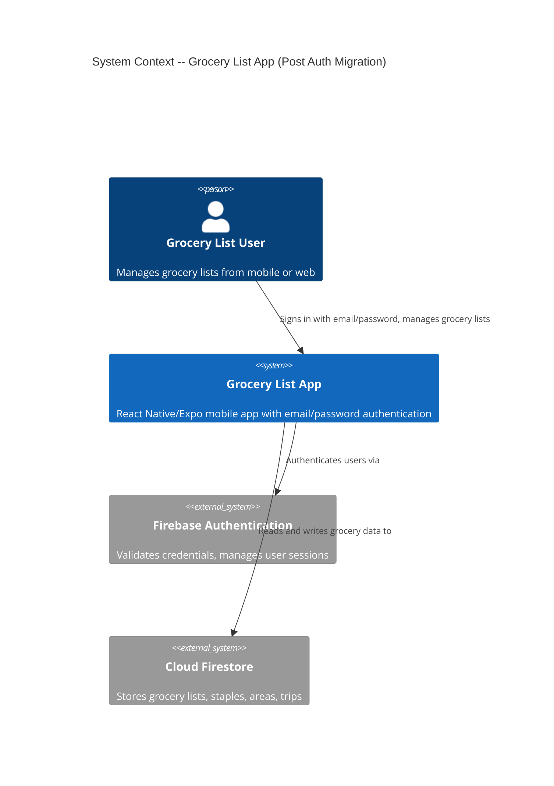
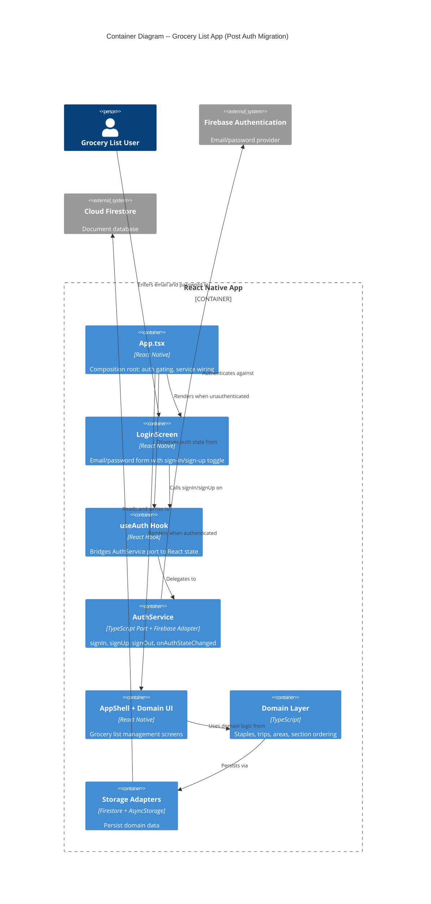

# Architecture Design: auth-password-migration

## System Context

This is a brownfield migration within an existing React Native/Expo grocery list app. The app uses ports-and-adapters (hexagonal) architecture with functional TypeScript. Authentication is handled by Firebase Auth, accessed through an `AuthService` port.

The migration replaces email-link (magic link) authentication with email/password authentication. The backend `AuthService` already implements `signIn(email, password)` and `signUp(email, password)`. The work is primarily UI and hook-layer changes.

## C4 System Context (L1)

## C4 Container (L2)

## Auth Flow (Post-Migration)

### Sign In Flow

1. User opens app -> `App.tsx` creates `AuthService`, passes to `useAuth`
2. `useAuth` subscribes to `onAuthStateChanged` -> no user -> `loading: false, user: null`
3. `App.tsx` renders `LoginScreen` with `signIn` and `signUp` props
4. User enters email + password, taps "Sign In"
5. `LoginScreen` validates input locally (non-empty email, valid format)
6. `LoginScreen` calls `signIn(email, password)` prop
7. `useAuth.signIn` delegates to `authService.signIn(email, password)`
8. `authService` calls Firebase `signInWithEmailAndPassword`
9. On success: Firebase triggers `onAuthStateChanged` -> `useAuth` updates `user` state -> `App.tsx` renders `AppShell`
10. On failure: `AuthResult.error` returned -> `LoginScreen` displays error message

### Sign Up Flow

Same as Sign In, with:
- Step 4: User switches to Sign Up mode via toggle
- Step 5: Additional validation -- password >= 8 characters
- Step 6: Calls `signUp(email, password)` instead
- Step 8: `authService` calls Firebase `createUserWithEmailAndPassword`

### Mode Toggle Flow

1. User taps "Don't have an account? Sign Up" (or reverse)
2. `LoginScreen` toggles internal mode state between 'signIn' and 'signUp'
3. Submit button label changes, form behavior changes
4. Error messages clear on toggle
5. Email field value persists across toggles

## What Changes vs. What Stays

### Removed

| Item | Location | Reason |
|------|----------|--------|
| `sendSignInLink` method | `AuthService` interface | Email-link flow removed |
| `handleSignInLink` method | `AuthService` interface | Email-link flow removed |
| `EMAIL_LINK_STORAGE_KEY` | `AuthService.ts` | No longer storing email for link completion |
| `ACTION_CODE_SETTINGS` | `AuthService.ts` | Dynamic Links config no longer needed |
| `useDeepLinkHandler` | `App.tsx` | No deep links to handle |
| `Linking` import | `App.tsx` | No deep link handling |
| `AsyncStorage` import | `AuthService.ts` | No email storage for link flow |
| Firebase link imports | `AuthService.ts` | `sendSignInLinkToEmail`, `isSignInWithEmailLink`, `signInWithEmailLink` |
| `src/components/LoginScreen.tsx` | Components dir | Dead prototype, not used by App.tsx |
| `src/components/LoginScreen.test.tsx` | Components dir | Tests for dead prototype |

### Modified

| Item | Location | Change |
|------|----------|--------|
| `AuthService` interface | `AuthService.ts` | Remove 2 methods, keep 5 |
| `createAuthService()` | `AuthService.ts` | Remove 2 method implementations |
| `createNullAuthService()` | `AuthService.ts` | Remove 2 method implementations, remove `pendingEmail` state |
| `UseAuthResult` type | `useAuth.ts` | Replace `sendSignInLink`/`handleSignInLink` with `signIn`/`signUp` |
| `useAuth` hook | `useAuth.ts` | Replace callbacks |
| `LoginScreen` | `src/ui/LoginScreen.tsx` | Full rewrite of UI: add password field, mode toggle, new props |
| `LoginScreenProps` | `src/ui/LoginScreen.tsx` | Replace `sendSignInLink` with `signIn`/`signUp` |
| `App.tsx` | Root | Remove deep link handler, update LoginScreen props |

### Unchanged

| Item | Reason |
|------|--------|
| `AuthUser` interface | No change to user shape |
| `AuthResult` interface | No change to result shape |
| `signIn`, `signUp`, `signOut` implementations in both adapters | Already correct |
| `getCurrentUser`, `onAuthStateChanged` | Already correct |
| All domain modules | No auth coupling |
| All storage adapters | No auth coupling |
| `AppShell` and all grocery UI | Downstream of auth gate |

## Integration Points

### External Integration: Firebase Authentication

- **API**: Firebase Auth SDK (`firebase/auth` package)
- **Methods used post-migration**: `createUserWithEmailAndPassword`, `signInWithEmailAndPassword`, `signOut`, `onAuthStateChanged`
- **Methods removed**: `sendSignInLinkToEmail`, `isSignInWithEmailLink`, `signInWithEmailLink`
- **Contract risk**: Low -- email/password auth is Firebase's most stable, long-lived auth method
- **Contract test recommendation**: Consumer-driven contracts via Pact-JS are available but low priority for this integration. Firebase Auth SDK is a thick client library with offline support, not a raw REST API. The NullAuthService serves as an effective contract double for testing.

## Quality Attribute Strategies

### Maintainability

- Pruning dead interface methods keeps the port honest and reduces adapter maintenance burden
- Removing dead code (deep link handler, old LoginScreen prototype) reduces confusion
- Architecture enforcement: existing ports-and-adapters structure with clear boundaries. Recommend `dependency-cruiser` for automated enforcement of import rules (UI -> hooks -> ports, never UI -> adapters directly)

### Testability

- `createNullAuthService` remains the primary test double
- LoginScreen testable via props (signIn/signUp functions) without any service wiring
- useAuth testable with NullAuthService (existing pattern)

### Security

- Password minimum 8 characters enforced at UI level before network call
- Firebase enforces its own minimum (6 chars) server-side as backstop
- Password field uses `secureTextEntry` (masked input)
- No passwords stored locally -- Firebase SDK handles session tokens

### Usability

- Single screen with mode toggle reduces navigation complexity
- Error messages are actionable (not generic "auth failed")
- Email field persists across mode switches

### Reliability

- Existing Firebase Auth session persistence unchanged -- users stay signed in across app restarts
- No migration needed for existing user sessions (Firebase handles this)

## Architectural Enforcement

**Recommended tool**: `dependency-cruiser` (MIT license, npm package)

**Rules to enforce**:
- `src/ui/**` may import from `src/hooks/**` and `src/auth/AuthService.ts` (types only), not from `src/adapters/**`
- `src/hooks/**` may import from `src/auth/AuthService.ts` (port), not from `src/adapters/**`
- `src/domain/**` must not import from `src/adapters/**`, `src/ui/**`, or `src/hooks/**`

This is a recommendation for future enforcement, not a blocker for this migration.
