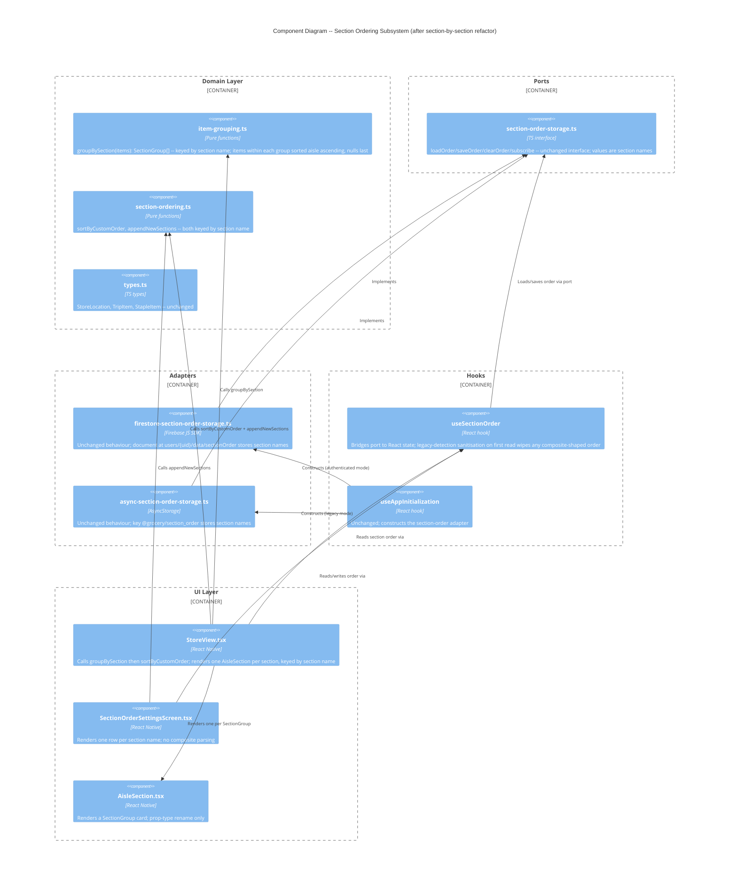

# Architecture Design: Section-Keyed Ordering

**Feature ID**: section-order-by-section
**Date**: 2026-04-27
**Refines**: `store-section-order` (composite-key version)
**Architect**: Morgan (DESIGN wave, PROPOSE mode)

---

## 1. System Context

This feature is a brownfield refactor of `store-section-order`. Today the section-ordering subsystem keys on the composite `section::aisleNumber`. Carlos's mental model is "section = orderable unit, aisle = sub-position within a section." The design refactors the ordering key from composite to section-name-only, adds intra-section aisle-ascending sort, narrows auto-append to section-name dedupe, and migrates legacy stored composite orders by wiping them on first read.

The change is **fully contained inside the existing hexagonal architecture** — same ports, same adapters, same hook, same screen, same dependency direction. No new modules. No new ports. No changes to the system-level container diagram. The work is a focused re-keying refactor inside one domain module (`section-ordering.ts`), one item-grouping module (`item-grouping.ts`), one hook (`useSectionOrder`), one screen (`SectionOrderSettingsScreen`), and one effective-order build site (`StoreView`).

---

## 2. Quality Attributes (Priority Order)

Inherited from `store-section-order` and the parent brief, plus this feature's specific concerns:

1. **Functional Suitability (correctness)** — the new key contract MUST produce one group per section regardless of aisle diversity. KPI 1.
2. **Maintainability** — same hexagonal pattern preserved; refactor must not introduce new modules or ports.
3. **Testability** — domain change is pure-function refactor; mutation testing applies (per `CLAUDE.md`, threshold ≥80%).
4. **Reliability under upgrade** — legacy composite-key data MUST NOT render as garbage. Wipe-on-detect is the chosen migration strategy (D3).
5. **Real-time consistency** — inherited; section-order document on Firestore continues to use `onSnapshot` (no change).

---

## 3. Constraints

- Functional paradigm: factories, pure functions, hooks, no classes.
- Existing hexagonal architecture preserved.
- Single user, minimal stored data → wipe migration is acceptable (D3).
- Firestore document path unchanged: `users/{uid}/data/sectionOrder`.
- AsyncStorage key unchanged: `@grocery/section_order`.
- Two adapters affected (Firestore + AsyncStorage). Migration logic must apply to both.

---

## 4. Existing System Analysis (Reuse Map)

Every module touched by this feature already exists. The refactor's design challenge is **where each behaviour change lives**, not what to build.

| Existing artifact | Current behaviour | Section-by-section change |
|---|---|---|
| `src/domain/types.ts` | `StoreLocation`, `TripItem` carry `aisleNumber` | Unchanged |
| `src/domain/item-grouping.ts` (`AisleGroup`, `groupByAisle`, `compareAisleGroups`) | Group key = `section::aisleNumber`; one group per pair | Group key = `section`; one group per section. `aisleNumber` removed from `AisleGroup`. Items inside group sorted aisle ascending, nulls last |
| `src/domain/section-ordering.ts` (`sortByCustomOrder`, `appendNewSections`, internal `groupKey`) | Operates on composite keys | Operates on section names. Internal `groupKey` simplified to `group.section` |
| `src/ports/section-order-storage.ts` | `string[] \| null` representing ordered keys | Unchanged interface; semantics shift (entries are section names, not composites) |
| `src/adapters/firestore/firestore-section-order-storage.ts` | Stores `{ order: string[] \| null }` | Unchanged adapter logic. Document schema is the same JSON shape; values are now section names |
| `src/adapters/async-storage/async-section-order-storage.ts` | Same storage shape | Unchanged adapter logic |
| `src/hooks/useSectionOrder.ts` | Bridges port to React state | Add legacy-detection sanitization on first read |
| `src/ui/SectionOrderSettingsScreen.tsx` | Renders one row per composite via `parseSectionKey`/`toSectionKey` | Renders one row per section name. Drop `parseSectionKey`/`toSectionKey`/`formatSectionDisplay`. Derive `knownSectionNames` from staples |
| `src/ui/StoreView.tsx` | Builds effective order from composite keys; renders one `AisleSection` per `AisleGroup` keyed by `${aisleNumber}-${section}` | Build effective order from section names; render one `AisleSection` per section; key by section |

**Verdict: zero new components.** This is a pure re-keying + intra-section-sort refactor.

---

## 5. The Four Design Questions

Brief states the four key questions the design must resolve. Each is answered after the options proposal in §6, but for orientation:

1. **`AisleGroup` → `SectionGroup` rename, or keep name and change semantics?** → **Rename to `SectionGroup`** (Option A's recommendation). The name `AisleGroup` is now misleading (groups are no longer keyed by aisle), and the rename is a single-pass mechanical refactor in a TypeScript codebase with strict mode and good tooling.
2. **Where does the aisle-ascending intra-section sort live?** → **Inside `groupByAisle`** (renamed `groupBySection`). The grouping function already touches every item to assign it to a group; sorting items within the group while constructing it is a constant-factor cost and keeps the contract "give me display-ready section groups" coherent. A separate `sortItemsWithinSection` step adds a function call site without adding a meaningful boundary.
3. **Migration logic location?** → **In `useSectionOrder`** at first read (one place, runs once per app session per user, both adapter implementations are immediately covered without per-adapter code). Putting it in the port would require mutating the port contract; putting it in each adapter would duplicate the logic.
4. **Schema version vs. presence-of-`::` detection?** → **Presence of `::` is sufficient** (per US-04). Section names are user-supplied strings that will never contain `::` in normal usage (no UI affordance produces it; the only source of `::` in storage is the prior composite encoding). Adding a schema version field is over-engineering for a single-user wipe-on-detect migration. Documented as ADR-004 trade-off.

---

## 6. Design Options

Three options are evaluated. All three keep the port unchanged and use the same adapter/hook/screen wiring; they differ in **module shape** and **where the intra-section sort lives**.

### Option A (recommended): Rename `AisleGroup` → `SectionGroup`; intra-section sort inside `groupBySection`

- `item-grouping.ts`: `AisleGroup` becomes `SectionGroup` (`{ section, items, totalCount, checkedCount }` — no `aisleNumber`). `groupByAisle` becomes `groupBySection`. The function's grouping reduce uses `item.storeLocation.section` as key. After grouping, items within each group are sorted aisle ascending (numbered first ascending, nulls last, then by name as a stable tie-break to preserve current behaviour). Section-level sort = alphabetical by section name (default) when no custom order is set.
- `section-ordering.ts`: `groupKey(group)` simplifies to `group.section`. `sortByCustomOrder` and `appendNewSections` operate on section names. The function bodies barely change; only the key derivation simplifies.
- `useSectionOrder.ts`: on first read after mount, the hook inspects loaded order. If any entry contains `::`, it calls `clearOrder()` synchronously and treats the order as `null`. The cleared state propagates to storage in the background via the adapter's existing `clearOrder` (which already does the right thing on Firestore + AsyncStorage).
- `SectionOrderSettingsScreen.tsx`: drops `parseSectionKey`, `toSectionKey`, `formatSectionDisplay`. `knownSectionKeys` becomes `knownSectionNames` derived from `stapleLibrary.listAll().map(s => s.storeLocation.section)` deduped. Rows render the section name directly.
- `StoreView.tsx`: builds `knownSectionNames` from `groups.map(g => g.section)`; passes that to `appendNewSections`. Renders `<AisleSection key={sectionGroup.section} sectionGroup={sectionGroup} ... />`. The `AisleSection` component receives the renamed type via prop name change (`sectionGroup` instead of `aisleGroup`); its internal rendering is otherwise unchanged.

**Pros**:
- Names match the new domain language. No future reader will be confused by an `AisleGroup` that does not key on aisle.
- Single-step refactor. TypeScript will surface every call site automatically.
- Intra-section sort co-located with the grouping that produces the items it sorts; one mental model.

**Cons**:
- Larger surface of mechanical name changes (every test, every import, every prop). Mitigated by tooling.
- `AisleSection` component name retained (it still renders one card representing what visually looks like an aisle row to the user); only its prop-type rename is required. This is mildly inconsistent but the user-facing label is unchanged and renaming the component is out of scope per the user's "section-order-by-section" framing.

### Option B: Keep `AisleGroup` name, redefine semantics

- `AisleGroup` keeps its name but loses the `aisleNumber` field. `groupByAisle` keeps its name but groups by section.
- All other elements identical to Option A.

**Pros**:
- Smaller diff (no rename).
- Lower test churn.

**Cons**:
- The type name `AisleGroup` will lie. A future reader sees `AisleGroup` and reasonably expects an aisle-keyed group. Maintainability cost compounds over time.
- Violates the principle that domain types should reflect domain language. Carlos and the user stories now talk in "sections," not "aisles."

### Option C: Keep `AisleGroup`, add a separate `sortItemsWithinSection` pure function

- `groupByAisle` retains current shape (returns `AisleGroup[]` keyed by composite) — but redefined to key by section name and retain `aisleNumber: null` in the type as a vestigial field.
- A new pure function `sortItemsWithinSection(group: AisleGroup): AisleGroup` sorts items by `aisleNumber` ascending. `StoreView` calls it after `groupByAisle`.

**Pros**:
- Maximally additive (no rename, no field removal). Minimal diff.

**Cons**:
- Adds a separate function call site for a sort that logically belongs with the grouping that produced it (Option B's con plus the cost of an extra primitive). The extra function does not earn its keep — there is no caller other than `StoreView` who would want a "grouped but unsorted" intermediate.
- Vestigial `aisleNumber: null` field in `AisleGroup` is a code smell that will outlive the refactor.
- Two-step pipeline (group, then sort within) where one step suffices.

### Recommendation: **Option A**

Option A produces the cleanest domain language, the most cohesive grouping function, and the smallest long-term maintenance footprint. The one-off cost of a rename is dwarfed by years of clarity. TypeScript strict-mode + the project's existing test coverage make the rename mechanical and safe. The `AisleSection` UI component name is left as-is to keep this refactor narrowly scoped (and because to a shopper, a "section card" and an "aisle section" feel like the same thing visually).

---

## 7. Data Flow After Refactor

```
trip items
   |
   v
groupBySection(items)        // src/domain/item-grouping.ts
   |  -> SectionGroup[] keyed by section name
   |  -> items[] inside each group sorted by aisle ascending, nulls last
   v
sortByCustomOrder(groups, effectiveOrder)   // src/domain/section-ordering.ts
   |  -> SectionGroup[] sorted by user's section order (or default alpha)
   v
StoreView renders <AisleSection key={sectionGroup.section} ... />

settings screen flow:
   stapleLibrary.listAll() -> distinct section names -> knownSectionNames[]
   useSectionOrder.order ?? null -> stored order
   appendNewSections(order, knownSectionNames) -> rendered list
```

The `effectiveOrder` build at the StoreView site:

```
knownSectionNames = unique sections from groups
effectiveOrder = sectionOrder !== null
                  ? appendNewSections(sectionOrder, knownSectionNames)
                  : null
sortedGroups = sortByCustomOrder(groups, effectiveOrder)
```

Same shape as today; only the key type changes from composite to section name.

---

## 8. Migration Strategy (US-04)

**Where**: `useSectionOrder` hook, on first read after mount.

**What**:
1. Hook calls `sectionOrderStorage.loadOrder()` to obtain stored value.
2. If returned value is `null` → no migration needed.
3. If returned value is `string[]` → check whether any entry contains `::`.
4. If any entry contains `::`, hook calls `sectionOrderStorage.clearOrder()` and treats local state as `null`.
5. The adapter's `clearOrder()` already removes the document from Firestore (via `setDoc` with `{ order: null }`) and removes the AsyncStorage key. Subsequent loads return `null`.
6. The migration is idempotent: a wiped store has `null`, which fails the legacy-detection predicate immediately on next launch.

**Why in the hook, not the port or adapters**:
- The port is pure (interface only) — adding migration there would be a contract change.
- The two adapters today share zero migration code; each adapter would need its own copy of the legacy-detection predicate. Hook-level migration runs once for whatever adapter the ServiceProvider supplies.
- The hook already encapsulates "what the React tree sees as the section order" — applying a sanitization filter at this boundary is a natural responsibility extension.

**Why presence-of-`::` is sufficient**:
- Section names are user input. Section names produced by the app's UI (the metadata sheet) cannot contain `::` (no editor allows it; users do not type literal `::` in Carlos's vocabulary).
- The only place `::` was ever introduced into stored `section_order` arrays is the prior composite-key encoder (`toSectionKey` in the old `SectionOrderSettingsScreen` and the old `groupKey` in `section-ordering.ts`). Both are removed by this feature.
- A schema version field would require a separate Firestore document write to set the version, plus version-aware reads. For a single-user app on a one-time refactor, that is over-engineering.
- Trade-off documented in **ADR-004**: if future stored values legitimately need to contain `::`, the predicate breaks. That is treated as acceptable risk; no current user flow produces such names. ADR-004 also documents the alternative (schema version) that was rejected.

---

## 9. C4 Component Diagram (L3) — Section-Ordering Subsystem (after refactor)



Note: dependency direction unchanged from `store-section-order`. Only renames + behaviour adjustments.

---

## 10. Quality Attribute Strategies

| Attribute | Strategy |
|---|---|
| Functional suitability | Domain examples in user stories drive unit tests. KPIs 1 and 2 measure cardinality post-refactor. Mutation testing on `item-grouping.ts` and `section-ordering.ts` ensures key derivation, intra-section sort, and append-dedupe are all genuinely tested |
| Maintainability | One module renamed. No new modules. Hexagonal direction preserved. `dependency-cruiser` rules unchanged |
| Testability | Domain functions remain pure; null adapter for storage; migration logic lives in hook and is testable via a fake `SectionOrderStorage` |
| Reliability under upgrade | Wipe-on-detect for legacy composite orders runs at first read; idempotent on subsequent loads. KPI 4 (zero `::` rows post-launch) verifies |
| Real-time consistency | Inherited; `onSnapshot` in Firestore adapter unchanged. The legacy-wipe write echoes back through the listener but is filtered by the existing own-write echo detection (serialised-equal snapshot skip) |

---

## 11. ATAM-Style Trade-off Points

- **Sensitivity (Maintainability)**: The rename `AisleGroup → SectionGroup` is the only sensitivity point. If the rename is rejected (Option B), maintainability degrades over the long term but functional behaviour is identical.
- **Trade-off (Reliability vs. Simplicity)**: Wipe-on-detect trades a one-time loss of customised order (trivial under D3) for migration code simplicity. A schema version would preserve the order across this refactor at the cost of version-handling logic in two adapters and an ADR-style migration step.
- **Risk**: If a future feature legitimately stores a section name containing `::`, the legacy predicate misfires. Mitigation: ADR-004 documents the predicate; if the constraint becomes false in the future, the predicate becomes a wipe trigger of the next migration. Acceptable for now (single user, narrow vocabulary).

---

## 12. Architectural Enforcement

Unchanged from `store-section-order`:

- Tool: `dependency-cruiser` (MIT)
- Rules:
  - `src/domain/**` must NOT import from `src/adapters/**`, `src/ui/**`, `src/hooks/**`
  - `src/ports/**` must NOT import from `src/adapters/**`
  - `src/domain/section-ordering.ts` must NOT import from `src/domain/item-grouping.ts` (composition boundary; communicate via shared types only)

The third rule continues to hold after this refactor: `section-ordering.ts` operates on `SectionGroup` (or just `string` keys) without importing the grouping function.

---

## 13. ADRs Produced

- **ADR-004**: Wipe-on-Detect Migration for Legacy Composite Section Orders. Documents the predicate choice and rejected alternative (schema version field).

No other architectural decisions warrant a new ADR — the domain refactor follows the existing hexagonal pattern; the rename is a non-architectural tactical decision; storage paths and document schemas are unchanged.

---

## 14. Open Questions / Contradictions Spotted

None blocking. One minor naming inconsistency to flag for the user:

- The UI component `AisleSection.tsx` retains its name even though it now renders a `SectionGroup`. This is intentional (out-of-scope rename) but worth surfacing if the user later wants UI naming to align. It does not affect behaviour or AC.
