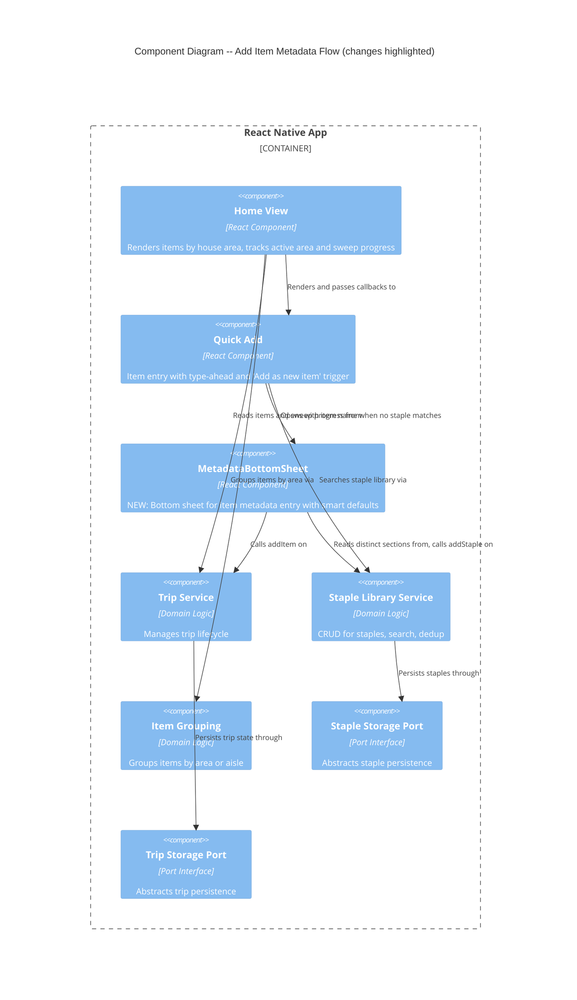

# Architecture Design: Add Item Metadata Flow

**Feature ID**: add-item-flow
**Wave**: DESIGN
**Date**: 2026-03-19
**Architect**: Morgan (Solution Architect)

---

## System Context

This feature adds a metadata entry flow to the existing QuickAdd component. When a user types a name that does not match any staple, they can open a bottom sheet to specify item type (staple/one-off), house area, store section, and aisle number. The feature wires entirely to existing domain operations -- no new domain types, ports, or adapters are needed.

### Capabilities Added

1. **Metadata Capture** -- Bottom sheet form for type, area, section, aisle when adding new items
2. **Context-Aware Defaults** -- Pre-fill type and area based on sweep state and active area
3. **Skip Metadata Shortcut** -- Bypass metadata entry to preserve speed
4. **Section Auto-Suggest** -- Suggest previously used section names from staple library
5. **Duplicate Detection** -- Warn when adding a staple that already exists in the same area

### Capabilities Unchanged

All existing domain logic (addStaple, addItem, isDuplicate, search, groupByArea, groupByAisle) remains untouched. No new ports, adapters, or domain types are introduced.

---

## C4 System Context (Level 1)

No change from grocery-smart-list architecture. The system boundary, actors, and external systems are identical. No new external integrations.

---

## C4 Container (Level 2)

No change. The application remains a single React Native app with AsyncStorage. No new containers.

---

## C4 Component (Level 3) -- Updated

The only change is the addition of the MetadataBottomSheet UI component and its relationships.



---

## Integration with Existing Components

### Data Flow: QuickAdd to MetadataBottomSheet

```
User types item name
    |
    v
QuickAdd.handleChangeText(text)
    |-- calls stapleLibrary.search(text)
    |-- receives suggestions: StapleItem[]
    |
    v
If suggestions.length === 0 OR no exact match:
    Show "Add '{name}' as new item..." row
    (always show below any partial suggestions)
    |
    v
User taps "Add as new item..."
    |-- QuickAdd calls onOpenMetadataSheet(name)
    |-- callback provided by HomeView
    |
    v
HomeView sets state: { sheetVisible: true, sheetItemName: name }
    |
    v
MetadataBottomSheet renders with:
    - itemName (read-only, from QuickAdd)
    - defaultType (from sweep state)
    - defaultArea (from activeArea state)
    - allAreasComplete (from sweepProgress)
    - sectionSuggestions (derived from stapleLibrary.listAll())
    - onSubmit callback
    - onSkip callback
    - onDismiss callback
```

### Data Flow: MetadataBottomSheet Submit

```
User fills form and taps "Add Item"
    |
    v
MetadataBottomSheet validates:
    - Section is not empty (required)
    - Area is selected (required)
    |
    v
If type === 'staple':
    |-- Check duplicate: stapleLibrary.search(name) filtered by area
    |-- If duplicate found:
    |     Show duplicate warning state
    |     User chooses "Add to trip instead" or "Cancel"
    |-- If no duplicate:
    |     Call stapleLibrary.addStaple({ name, houseArea, storeLocation })
    |     Call tripService.addItem({ name, houseArea, storeLocation, itemType: 'staple', source: 'quick-add' })
    |
    v
If type === 'one-off':
    |-- Call tripService.addItem({ name, houseArea, storeLocation, itemType: 'one-off', source: 'quick-add' })
    |-- Do NOT call addStaple
    |
    v
Dismiss sheet, clear QuickAdd input
```

### Data Flow: Skip Metadata

```
User taps "Skip, add with defaults"
    |
    v
MetadataBottomSheet calls onSkip with:
    - name: itemName
    - houseArea: activeArea ?? 'Kitchen Cabinets'
    - storeLocation: { section: 'Uncategorized', aisleNumber: null }
    - itemType: 'one-off'
    - source: 'quick-add'
    |
    v
HomeView calls tripService.addItem(request)
Dismiss sheet, clear QuickAdd input
```

### Section Auto-Suggest Derivation

Section suggestions are derived from existing staple library data. No new domain function is needed -- the UI component derives them at render time:

```
stapleLibrary.listAll()
  -> map to storeLocation.section
  -> filter to distinct values
  -> filter by prefix match against current section input
  -> return as string[]
```

This is a pure UI-layer derivation. It does not belong in the domain because:
- It is a presentation concern (auto-complete suggestions)
- The domain already exposes listAll() which provides the raw data
- Adding a "getDistinctSections" to the domain would couple it to a UI interaction pattern

### Context-Aware Defaults Logic

Defaults are computed in HomeView before passing to MetadataBottomSheet:

| Condition | Default Type | Default Area |
|-----------|-------------|--------------|
| Sweep in progress, area active | Staple | Active area |
| Sweep in progress, no area active | Staple | No default (must select) |
| All areas complete (whiteboard mode) | One-off | No default (must select) |

This is pure UI state derivation from existing `sweepProgress.allAreasComplete` and `activeArea` state already managed in HomeView.

---

## State Management

### Principle: State Stays Local

MetadataBottomSheet manages its own form state internally (selected type, selected area, section text, aisle text, duplicate warning). This follows React's recommendation of keeping state as close to where it is used as possible.

### State Ownership

| State | Owner | Rationale |
|-------|-------|-----------|
| `sheetVisible` | HomeView | HomeView orchestrates open/dismiss lifecycle |
| `sheetItemName` | HomeView | Set by QuickAdd callback, read by sheet |
| Form fields (type, area, section, aisle) | MetadataBottomSheet | Internal form state, no external consumer |
| Duplicate warning state | MetadataBottomSheet | Transient UI state within the sheet |
| `activeArea` | HomeView | Already exists, passed as prop to sheet for defaults |
| `sweepProgress` | HomeView (via useTrip) | Already exists, used to derive default type |

### No New Hooks Needed

The feature does not require new custom hooks. HomeView already has `useTrip` (provides addItem, sweepProgress) and `useServices` (provides stapleLibrary). MetadataBottomSheet receives everything it needs via props.

---

## Bottom Sheet Implementation

### Decision: React Native Modal

Use React Native's built-in `Modal` component with `animationType="slide"` and `presentationStyle="pageSheet"` (iOS) for the bottom sheet behavior.

**Rationale**:
- Zero new dependencies (constraint: no new runtime dependencies)
- `Modal` with slide animation provides bottom sheet UX on both platforms
- The form content is simple (5 fields + 2 buttons) -- no need for gesture-based sheet dismissal or snap points
- Performance is sufficient for a static form (not a scrollable list)

**Rejected alternatives**:
- `@gorhom/bottom-sheet` -- Excellent library (MIT), but adds a native dependency requiring rebuild. Violates the "no new runtime dependencies" constraint. Would be the choice if gesture-based sheet interaction (drag to dismiss, snap points) were needed.
- Custom Animated.View -- More control but reinvents what Modal already provides. Higher effort for equivalent result.

This decision is captured in ADR-004.

---

## Quality Attribute Strategies

### Performance (K4 guardrail: add time < 10 seconds)

- Bottom sheet open is synchronous (Modal render, no async data loading)
- Section suggestions derived from in-memory staple library (already loaded)
- Duplicate check is in-memory search over small dataset (< 100 staples)
- Submit path: addStaple + addItem are synchronous domain operations with async storage writes (fire-and-forget, non-blocking)
- Skip path: single addItem call, immediate dismiss

### Usability (MK2: metadata entry < 10 seconds)

- Smart defaults reduce decisions: during sweep, type and area are pre-filled (2 of 4 fields)
- Section auto-suggest reduces typing: prefix match from existing sections
- Skip shortcut: 1 tap to bypass all metadata
- "Add as new item" row always visible when input has text (even alongside partial matches)

### Data Integrity (MK3: zero misclassification)

- Duplicate detection uses existing domain logic (name + area uniqueness)
- "Add to trip instead" recovery prevents accidental duplicates
- Section auto-suggest prevents typo-based section fragmentation

### Testability

- MetadataBottomSheet receives all dependencies as props (staple library, trip service, callbacks)
- No direct context access in the sheet -- HomeView bridges context to props
- Form state is local, testable via @testing-library/react-native
- Submit/skip logic is callback-based, easily assertable

---

## Requirements Traceability

| User Story | Component(s) | Domain Operation(s) Used |
|-----------|-------------|-------------------------|
| US-AIF-01: Bottom sheet metadata entry | QuickAdd (trigger), MetadataBottomSheet (form), HomeView (orchestration) | addStaple, addItem |
| US-AIF-02: Context-aware defaults | HomeView (derives defaults), MetadataBottomSheet (applies defaults) | sweepProgress (read-only) |
| US-AIF-03: Skip metadata shortcut | MetadataBottomSheet (skip button) | addItem |
| US-AIF-04: Section auto-suggest | MetadataBottomSheet (section field) | listAll (read-only) |
| US-AIF-05: Duplicate detection | MetadataBottomSheet (warning state) | search + addItem (recovery) |

---

## Architecture Enforcement

Existing dependency-cruiser rules (from ADR-001) apply without modification:
- MetadataBottomSheet lives in `src/ui/` -- it may import from `src/domain/types` but not from `src/ports/` or `src/adapters/`
- No new domain imports are introduced
- All domain access flows through the ServiceProvider context, consumed by HomeView, passed as props to MetadataBottomSheet

No new enforcement rules are needed for this feature.

---

## External Integrations

None. This feature is entirely offline, local-only. No contract testing annotations needed.

---

## File Placement

```
src/ui/
  MetadataBottomSheet.tsx    # NEW: Bottom sheet component
  QuickAdd.tsx               # MODIFIED: Add "Add as new item" row + onOpenMetadataSheet callback
  HomeView.tsx               # MODIFIED: Orchestrate sheet visibility, pass context-aware defaults
```

No new files in `src/domain/`, `src/ports/`, `src/adapters/`, or `src/hooks/`.
