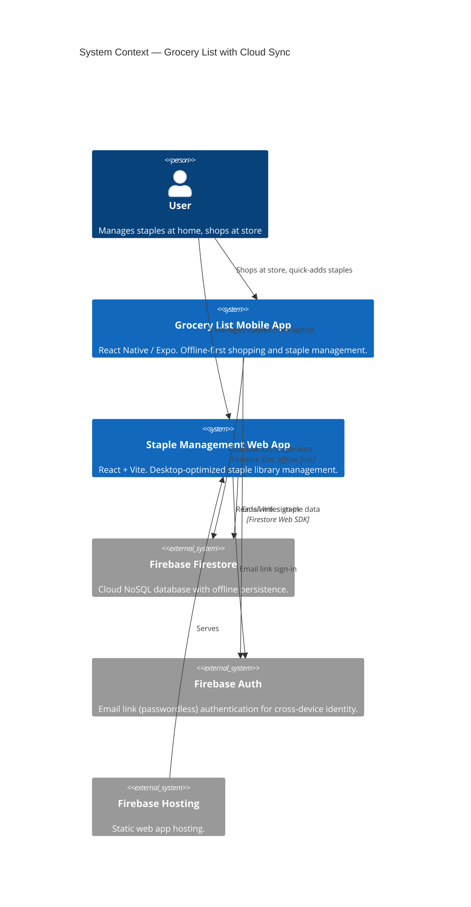
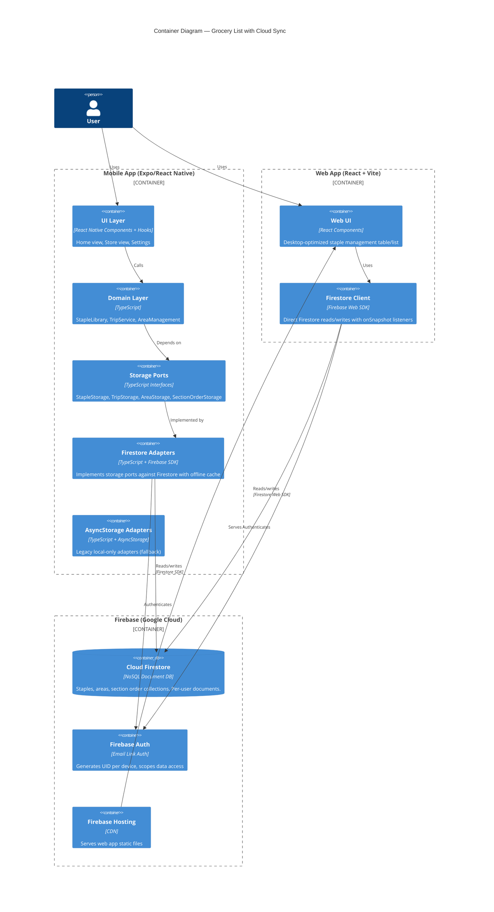
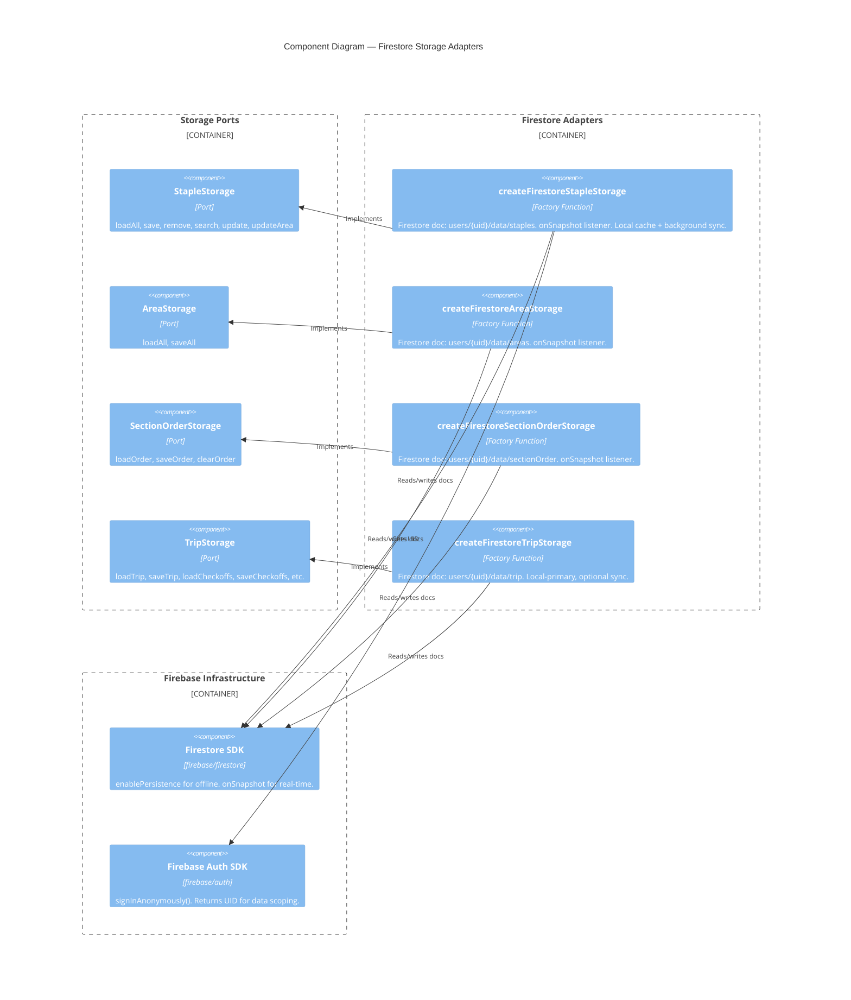

# Architecture Design — cloud-sync-and-web

## Overview

Add cloud sync via Firebase Firestore to the existing grocery list mobile app, and build a dedicated React+Vite web app for staple management. Both clients share the same Firestore backend. The mobile app remains offline-first using Firestore's built-in persistence.

## Architecture Pattern

**Existing**: Ports-and-adapters (hexagonal) — preserved and extended.

**Extension strategy**: Create new Firestore-backed adapters that implement the existing storage ports. The domain layer and UI layer remain unchanged. The web app reuses domain types and implements its own UI against the same Firestore collections.

## C4 System Context Diagram



## C4 Container Diagram



## C4 Component Diagram — Firestore Adapters



## Data Flow: Sync Lifecycle

```
MOBILE APP                          FIRESTORE                        WEB APP
───────────                         ─────────                        ───────
1. App opens
2. signInAnonymously() ──────────→ Returns UID
3. enablePersistence()              (offline cache enabled)
4. onSnapshot(staples doc) ──────→ Listener registered ←──────── onSnapshot(staples doc)
5. Firestore SDK serves             Sends initial snapshot            Sends initial snapshot
   from local cache if offline      to both clients                   to web client
6. User edits staple ──────────→ setDoc() ──────────────────────→ onSnapshot fires
   (optimistic: UI updates          (queued if offline,              Web sees update
    immediately from cache)          sent when online)                instantly

7. [At store, spotty wifi]
   User quick-adds staple
   → SDK writes to local cache
   → SDK retries sync in background
   → Eventually reaches Firestore ──────────────────────────────→ Web sees update
```

## Firestore Data Model

```
firestore/
  users/
    {uid}/
      data/
        staples    → { items: StapleItem[] }
        areas      → { items: HouseArea[] }
        sectionOrder → { order: string[] | null }
        trip       → { trip: Trip, checkoffs: Record<string, boolean>, carryover: TripItem[] }
```

Each data category is a single document under `users/{uid}/data/`. This keeps things simple (no subcollections) and maps directly to the existing storage port model where each port manages one logical data set.

**Why single documents, not subcollections?**
- The data sets are small (tens to low hundreds of items)
- The existing ports load/save entire collections atomically
- Firestore offline persistence works per-document
- Avoids N+1 query issues

## Authentication Flow

```
1. App starts → check if Firebase auth state exists
2. If not signed in: show email input screen
3. User enters email → sendSignInLinkToEmail()
4. User clicks link in email → signInWithEmailLink()
5. Auth state persisted locally — user only signs in once per device
6. UID (derived from email) used as document path: users/{uid}/data/*
7. Same email on mobile + web = same UID = same data
```

**Cross-device identity**: Email link auth solves the cross-device problem — same email on any device gets the same UID and sees the same data. No account linking needed.

## Offline-First Strategy (Mobile)

Firestore SDK handles offline persistence natively, but requires explicit configuration on React Native:

### Firebase SDK Setup for React Native

```
1. Initialize Firebase app with project config
2. Call initializeFirestore() with:
   - experimentalForceLongPolling: true (required for React Native)
   - localCache: persistentLocalCache() with default tab manager
3. This MUST happen before any Firestore read/write operations
4. Platform-specific notes:
   - iOS/Android (Expo Go): Firestore persistence works out of the box after initialization
   - Web: Persistence enabled by default in Firebase v9+
   - Expo Go limitations: Test on real device build if persistence issues arise
```

### How Offline Persistence Works

1. `persistentLocalCache()` at initialization — creates local IndexedDB/SQLite cache
2. All reads served from cache first, then updated via network
3. All writes go to cache immediately, queued for network sync
4. `onSnapshot` listeners fire for both cache and network changes (with `fromCache` metadata)
5. No custom sync logic needed — Firestore SDK manages the queue

**What this means for the adapters**: The Firestore adapters are structurally similar to the AsyncStorage adapters — the Firestore SDK's local cache plays the same role as the current in-memory cache. Reads are fast (local), writes are optimistic (local first, network later).

### Offline Queue Behavior

Firestore SDK queues pending writes to disk (not just memory). Queue survives app restarts. For a single-user grocery app, the queue will never grow large enough to be a concern (typical usage: a few writes per session). Extended offline periods (days) are safe — all queued writes sync when connectivity returns.

## Known Limitations

### Single-Device Active Editing Assumption

This architecture assumes **one device actively editing at a time**. If the same user edits staples on two devices while either is offline, last-write-wins at the document level may cause data loss:

- Example: User adds "Olive Oil" on mobile (offline). Meanwhile, adds "Pasta" on web. Mobile syncs later — mobile's document write overwrites web's (or vice versa, depending on timing).
- **Why this is acceptable**: Single user, personal app. The typical workflow is "manage on laptop, shop on phone" — not simultaneous editing.
- **If this becomes a problem**: Implement per-item granularity (subcollections instead of single document) or operational merge. This is a future enhancement, not needed for walking skeleton.

## Migration Strategy (AsyncStorage → Firestore)

Migration is tied to the **first email link sign-in**, not app startup. This ensures migration runs once per UID globally, preventing multi-device race conditions.

```
1. User signs in via email link → UID established
2. Check Firestore: does users/{uid}/data/staples document exist?
3. If Firestore is EMPTY (first sign-in ever for this UID):
   a. Read all data from AsyncStorage (existing adapters)
   b. Write all data to Firestore (new adapters)
   c. Set migration flag in AsyncStorage
4. If Firestore has data (second device signing in):
   a. Skip migration — Firestore is already populated
   b. Local AsyncStorage data is stale; Firestore is authoritative
   c. Set migration flag in AsyncStorage (prevent future attempts)
5. AsyncStorage adapters kept as fallback (no deletion)
```

**Multi-device safety**: Device B signing in after Device A has already migrated will see Device A's data in Firestore and skip its own migration. No duplicate writes, no race condition. The Firestore document existence check is the coordination point.

## Web App Architecture

```
web/
  src/
    App.tsx              — Main app component
    firebase.ts          — Firebase config + initialization
    hooks/
      useAuth.ts         — Email link sign-in hook
      useStaples.ts      — Firestore onSnapshot → React state
      useAreas.ts        — Firestore onSnapshot → React state
      useSectionOrder.ts — Firestore onSnapshot → React state
    components/
      StapleTable.tsx    — Desktop-optimized table/list view
      StapleForm.tsx     — Add/edit staple form
      AreaFilter.tsx     — Filter/group by area
    types/               — Shared domain types (copied or symlinked from mobile)
  vite.config.ts
  package.json
  index.html
```

The web app is intentionally simple — no routing, no state management library. Just React hooks listening to Firestore snapshots and rendering a table.

## Shared Code Strategy

Domain types (`src/domain/types.ts`) are shared between mobile and web. Options:
1. **Copy types file** — Simplest. Small type file, rarely changes. Risk of drift.
2. **Monorepo with shared package** — More infrastructure but keeps types in sync.
3. **Symlink** — Works locally but fragile for CI.

**Recommendation**: Start with copy (Walking Skeleton), evaluate monorepo if drift becomes a problem.
