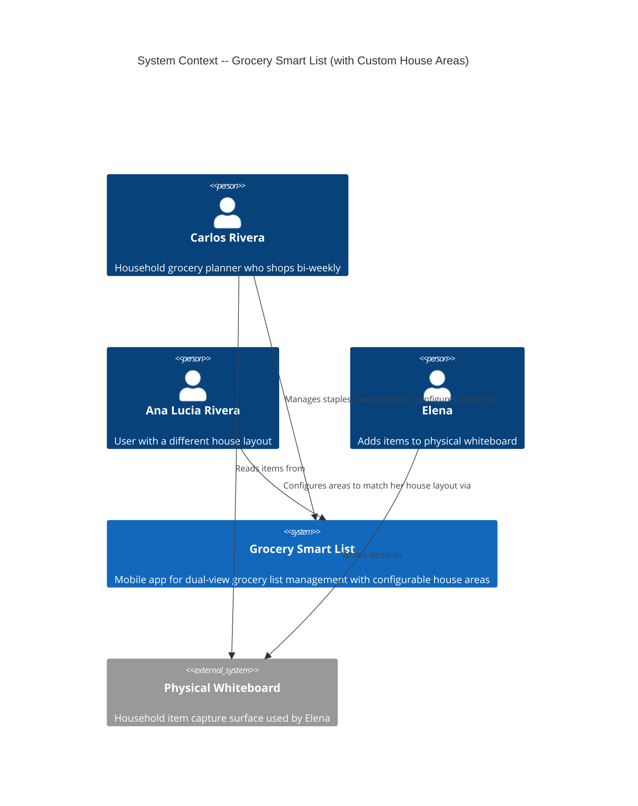
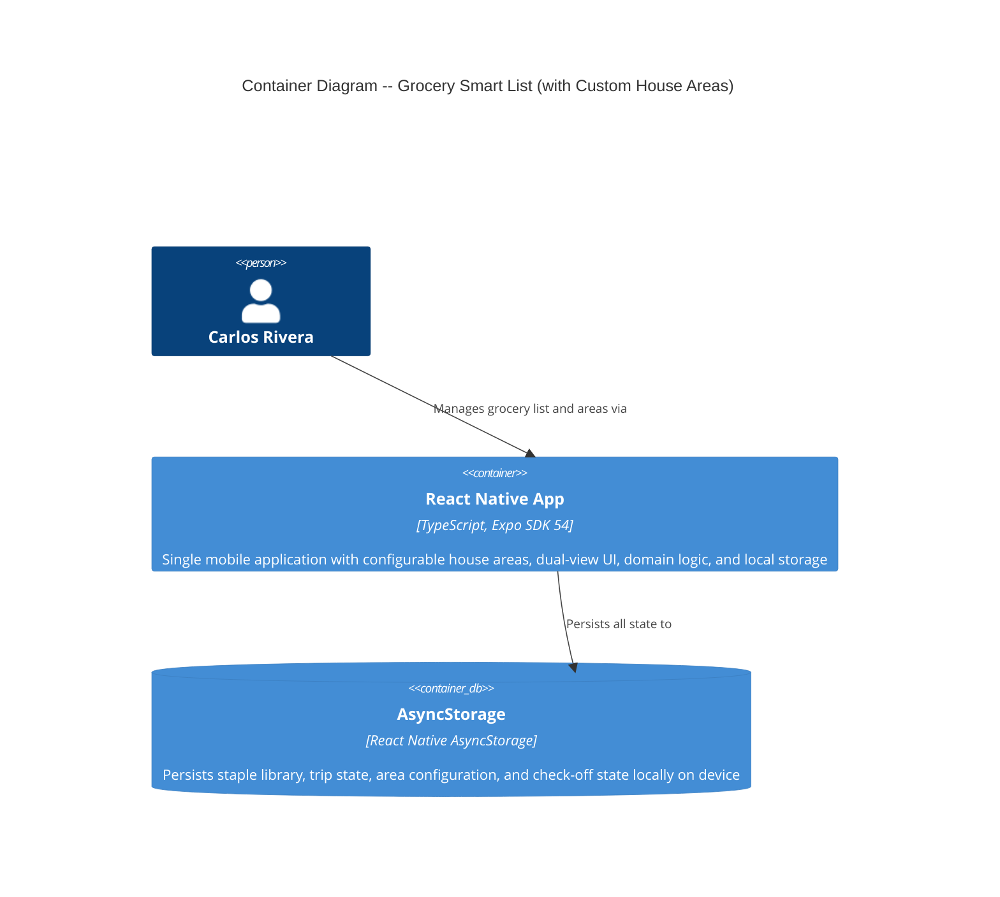

# Architecture Design: Custom House Areas

**Feature ID**: custom-house-areas
**Wave**: DESIGN
**Date**: 2026-03-20
**Architect**: Morgan (Solution Architect)

---

## System Context and Capabilities

The Custom House Areas feature makes house areas user-configurable within the existing Grocery Smart List mobile app. This is a cross-cutting change that replaces the hardcoded `HouseArea` union type with a dynamic, persisted area list. The 5 original areas become defaults seeded on first launch. No new external integrations are introduced.

### New Capabilities

1. **Area Management** -- Add, rename, delete, and reorder house areas via a settings screen
2. **Dynamic Area Consumption** -- All domain logic and UI read areas from storage, not code constants
3. **Rename Propagation** -- Renaming an area cascades to all staples and trip items referencing it
4. **Delete with Reassignment** -- Deleting an area moves its staples and trip items to a user-chosen target

### Unchanged Capabilities

- Staple Library Management, Trip Lifecycle, Dual-View Rendering, Offline Persistence -- all preserved

---

## C4 System Context (Level 1)

No change from the grocery-smart-list system context. The system boundary, actors, and external systems remain identical. Carlos and Elena interact with the same mobile app. No new external services.

---

## C4 Container (Level 2)

No change. The system remains a single React Native app with AsyncStorage. No new containers, services, or data stores.

---

## C4 Component (Level 3)

Updated to reflect new Area Management components and modified relationships. New components are marked with "(NEW)".

```mermaid
C4Component
  title Component Diagram -- React Native App (with Custom House Areas)

  Container_Boundary(app, "React Native App") {
    Component(home_view, "Home View", "React Component", "Renders items grouped by house area for sweep, reads areas from AreaStorage")
    Component(settings_view, "Area Settings View", "React Component (NEW)", "Lists areas, provides add/rename/delete/reorder actions")
    Component(store_view, "Store View", "React Component", "Renders items grouped by aisle/section for shopping")
    Component(quick_add, "Quick Add", "React Component", "Item entry with type-ahead suggestions")
    Component(metadata_sheet, "Metadata Bottom Sheet", "React Component", "Area picker reads areas from AreaStorage")

    Component(area_service, "Area Management Service", "Domain Logic (NEW)", "Add, rename, delete, reorder areas with validation and propagation")
    Component(area_validation, "Area Name Validation", "Domain Logic (NEW)", "Pure validation: non-empty, unique, max 40 chars")
    Component(trip_service, "Trip Service", "Domain Logic", "Trip lifecycle, sweep progress uses dynamic area count")
    Component(staple_service, "Staple Library Service", "Domain Logic", "CRUD for staple items")
    Component(item_grouping, "Item Grouping", "Domain Logic", "Groups by area using dynamic area list parameter")

    Component(area_port, "Area Storage Port", "Port Interface (NEW)", "Abstracts area list persistence")
    Component(staple_port, "Staple Storage Port", "Port Interface", "Abstracts staple library persistence")
    Component(trip_port, "Trip Storage Port", "Port Interface", "Abstracts trip state persistence")

    Component(area_adapter, "Area Storage Adapter", "AsyncStorage Adapter (NEW)", "Implements area persistence with default seeding")
    Component(staple_adapter, "Staple Storage Adapter", "AsyncStorage Adapter", "Persists staple library, extended with bulk rename")
    Component(trip_adapter, "Trip Storage Adapter", "AsyncStorage Adapter", "Persists trip state, extended with bulk rename")
  }

  ContainerDb(async_storage, "AsyncStorage", "Local device storage")

  Rel(home_view, item_grouping, "Groups items by area via")
  Rel(home_view, trip_service, "Reads trip items from")
  Rel(settings_view, area_service, "Manages areas via")
  Rel(metadata_sheet, area_port, "Reads area list from")
  Rel(quick_add, staple_service, "Searches staple library via")

  Rel(area_service, area_validation, "Validates area names via")
  Rel(area_service, area_port, "Persists area list through")
  Rel(area_service, staple_port, "Propagates renames/deletes to staples through")
  Rel(area_service, trip_port, "Propagates renames/deletes to trip items through")

  Rel(trip_service, trip_port, "Persists trip state through")
  Rel(staple_service, staple_port, "Persists staples through")

  Rel(area_adapter, async_storage, "Reads/writes area data to")
  Rel(staple_adapter, async_storage, "Reads/writes staple data to")
  Rel(trip_adapter, async_storage, "Reads/writes trip data to")
```

---

## Architectural Changes from Baseline

### What Changes

| Component | Change Type | Description |
|-----------|-------------|-------------|
| `types.ts` | Modified | `HouseArea` changes from union to `string` |
| `item-grouping.ts` | Modified | `groupByArea` accepts area list parameter, `ALL_HOUSE_AREAS` constant removed |
| `trip.ts` | Modified | `getSweepProgress` accepts dynamic area count, `ALL_HOUSE_AREAS` constant removed |
| `MetadataBottomSheet.tsx` | Modified | Area picker reads from injected area list, `HOUSE_AREAS` constant removed |
| `HomeView.tsx` | Modified | Reads area list from context, passes to `groupByArea` and sweep progress |
| `useTrip.ts` | Modified | `completeArea` and `sweepProgress` use dynamic area count |
| `ServiceProvider.tsx` | Modified | Exposes area list and area service in context |
| `area-management.ts` | New | Domain logic for area CRUD + rename/delete propagation |
| `area-validation.ts` | New | Pure validation function for area names |
| `area-storage.ts` (port) | New | Port interface for area persistence |
| `async-area-storage.ts` | New | AsyncStorage adapter with default seeding |
| `null-area-storage.ts` | New | Null adapter for testing |
| `AreaSettingsView.tsx` | New | Settings screen for area management |
| `useAreas.ts` | New | Hook bridging AreaStorage to React state |

### What Does NOT Change

- `staple-library.ts` domain logic (still takes `HouseArea` parameter, now `string`)
- Store View (groups by aisle, unaffected by area changes)
- Trip lifecycle flow (start, populate, check-off, complete)
- AsyncStorage as the persistence technology
- Ports-and-adapters architecture style

---

## New Port: AreaStorage

### Rationale: Separate Port vs Extending StapleStorage

AreaStorage is a separate port because:
1. **Different lifecycle**: Areas are managed independently of staples
2. **Different data shape**: Ordered list of named areas vs collection of item records
3. **Different access pattern**: Areas are read on every screen; staples only on trip-related screens
4. **Single Responsibility**: StapleStorage manages item records, AreaStorage manages area configuration

### AreaStorage Port Contract

Operations:
- `loadAll` -- Returns the ordered list of area names
- `saveAll` -- Persists the complete ordered list (atomic replacement)

The port uses a simple "load all / save all" pattern rather than individual CRUD operations because:
- The area list is small (typically 5-15 items)
- Atomic replacement eliminates partial-update consistency issues
- Reordering, adding, and deleting all produce a new complete list
- Matches the established AsyncStorage pattern of full-JSON-document writes

### Default Seeding

The AreaStorage adapter handles first-launch seeding:
- On `initialize()`, if no area data exists in AsyncStorage, seed with the 5 defaults: `['Bathroom', 'Garage Pantry', 'Kitchen Cabinets', 'Fridge', 'Freezer']`
- Existing users who upgrade also get seeded (no prior area data exists)
- After seeding, the area list is user-owned and fully mutable

---

## Rename Propagation Strategy

### Design Decision: Domain-Orchestrated Batch Operation

Rename is orchestrated by the Area Management Service, which coordinates writes across three storage ports:

1. Load current area list, replace old name with new name, save area list
2. Load all staples, update `houseArea` field for matching staples, save all staples
3. Load active trip, update `houseArea` field for matching trip items, save trip

### Why Domain Orchestration (Not Adapter-Level)

- Rename logic is a business rule (what gets renamed, validation, propagation scope)
- Domain orchestration keeps the business rule visible and testable
- Each port write is already atomic (full-document replacement via AsyncStorage)
- Cross-port atomicity is not critical: if the app crashes mid-rename, the next rename attempt can complete the propagation (area names are idempotent)

### Port Extensions for Propagation

StapleStorage needs a new operation: `updateArea(oldName: string, newName: string)` -- batch-updates all staples matching `oldName`.

TripStorage needs a new operation: `updateItemArea(oldName: string, newName: string)` -- batch-updates all trip items matching `oldName`.

These operations are on the port interface (not internal adapter implementation) because the domain service must call them. The adapter implements them as load-all, transform, save-all.

---

## Delete with Reassignment Strategy

### Design Decision: Domain-Orchestrated Multi-Step

Delete with reassignment follows the same domain orchestration pattern as rename:

1. Validate: target area exists, source is not the last area
2. Move staples from source area to target area (same as rename propagation to target)
3. Move trip items from source area to target area
4. Remove source area from area list, save area list

### Duplicate Detection on Reassignment

When moving staples to the target area, duplicate detection is needed: a staple with the same name may already exist in the target area. This is a domain concern -- the Area Management Service detects conflicts and returns them as a result type for the UI to handle (the user must resolve conflicts before deletion proceeds).

---

## Dynamic Area Consumption

### groupByArea Signature Change

Current: `(items: TripItem[]) => AreaGroup[]`
New: `(items: TripItem[], areas: readonly string[]) => AreaGroup[]`

The function creates a group for each area in the provided list (in order), assigning items to their matching area. Items referencing an area not in the list are collected in an "Other" overflow group (defensive, should not happen in normal operation).

### getSweepProgress Change

Current: uses `ALL_HOUSE_AREAS.length` constant
New: accepts area count as parameter or reads from context

The `TripService.getSweepProgress` and `TripService.completeArea` signatures change to accept the dynamic area list. The `totalAreas` field in `SweepProgress` is derived from the injected area count.

### AreaGroup Type Change

Current: `area: HouseArea` (union type)
New: `area: string`

### MetadataBottomSheet Area Picker

Current: hardcoded `HOUSE_AREAS` constant
New: receives area list as prop from parent (HomeView reads from context)

---

## Migration Strategy

### For Existing Users

Existing users have staples and trip items with `houseArea` values matching the 5 original strings. No data migration is needed because:
- The AreaStorage adapter seeds the same 5 default names on first launch
- Existing staple and trip data already uses these exact strings
- The type change from union to `string` is a compile-time change only; runtime data is already strings

### For New Users

New users get the 5 defaults seeded into AreaStorage. Identical to existing behavior until they customize.

### Schema Version

The AreaStorage adapter uses a new AsyncStorage key (`@grocery/house_areas`). No migration of existing keys is needed. The `schema_version` pattern from ADR-002 applies: area data starts at version 1.

---

## Quality Attribute Strategies

### Offline-First (Preserved)

- Area configuration stored in AsyncStorage, same as staples and trips
- Zero network calls for any area management operation
- All area CRUD works without connectivity

### Performance

- Area list loaded into memory on app start (alongside staples and trips)
- One additional AsyncStorage read on launch (area list is < 1 KB)
- Rename/delete propagation: load-transform-save is fast for < 100 items
- No performance regression expected; area list is an order of magnitude smaller than staple library

### Data Integrity

- **No orphaned staples**: Delete requires reassignment before area removal
- **No duplicates on reassignment**: Conflict detection before merge
- **Minimum 1 area**: Domain validation prevents deleting the last area
- **Case-insensitive uniqueness**: Validation prevents "Bathroom" and "bathroom" coexisting
- **Rename consistency**: Domain orchestration ensures all three stores (areas, staples, trips) are updated

### Testability

- Area validation is a pure function (zero dependencies, directly testable)
- Area Management Service testable with null adapters for all three ports
- `groupByArea` remains a pure function (now takes explicit area list -- even easier to test)
- Null AreaStorage adapter for all component and integration tests

### Maintainability

- AreaStorage is a separate port with its own adapter -- no coupling to staple or trip storage
- All hardcoded area constants eliminated (single source of truth in storage)
- Validation logic is a reusable pure function (add and rename share it)

---

## Architecture Enforcement

Existing dependency-cruiser rules from the grocery-smart-list design apply. Additional rule:

- `src/domain/area-management.ts` and `src/domain/area-validation.ts` have zero imports from `src/adapters/`, `src/ui/`, `react-native`, `@react-native-async-storage`
- `src/ports/area-storage.ts` has zero imports from adapter implementations
- No file in `src/domain/` imports the `HouseArea` union type (it no longer exists as a union)

---

## External Integrations

**None.** This feature is entirely local. No contract testing annotations needed.

---

## Requirements Traceability

| User Story | Component(s) | Quality Attribute |
|-----------|-------------|------------------|
| US-CHA-01: View Area List | Area Settings View, AreaStorage Port/Adapter | Usability |
| US-CHA-02: Add Area | Area Management Service, Area Settings View, AreaStorage | Data Integrity |
| US-CHA-03: Dynamic Consumption | Item Grouping, Trip Service, HomeView, MetadataBottomSheet | Maintainability, Performance |
| US-CHA-04: Rename Area | Area Management Service, StapleStorage, TripStorage | Data Integrity |
| US-CHA-05: Delete Area | Area Management Service, StapleStorage, TripStorage | Data Integrity |
| US-CHA-06: Reorder Areas | Area Settings View, AreaStorage | Usability |
| US-CHA-07: Validation | Area Validation (pure function) | Data Integrity |
