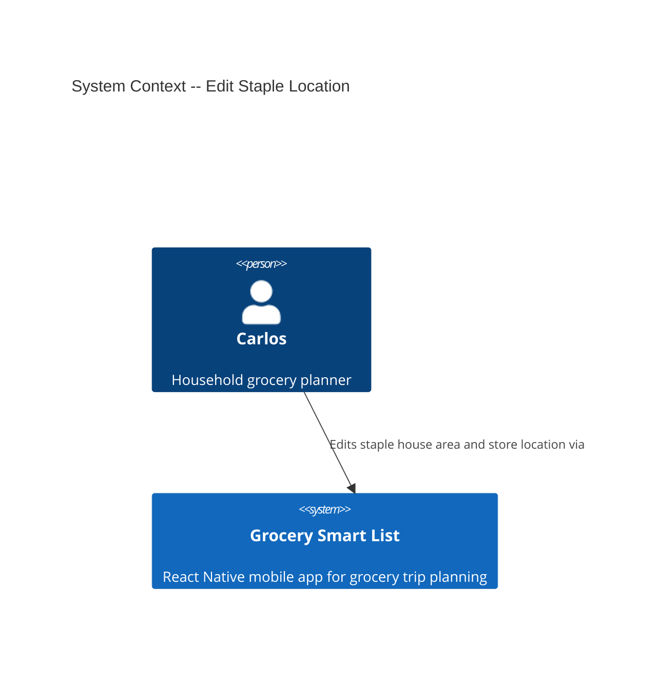
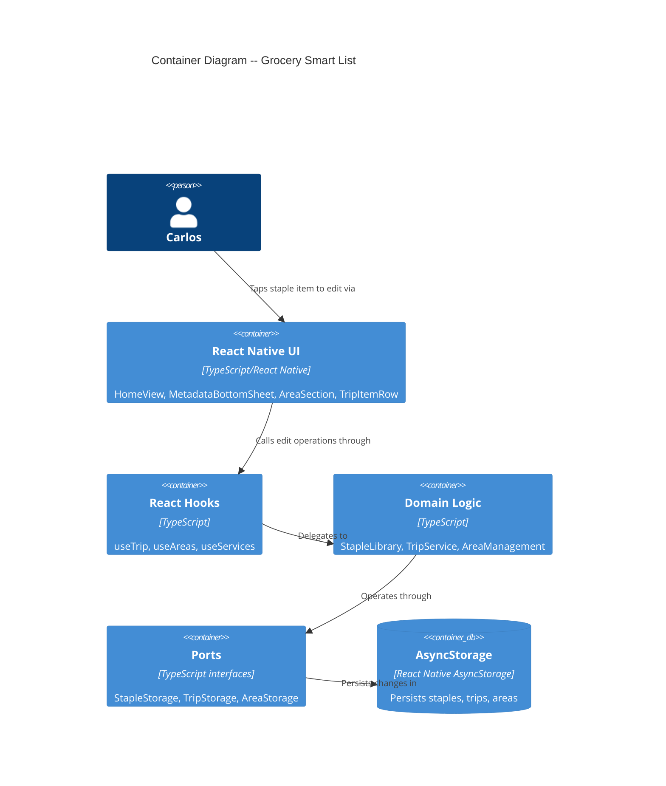

# Architecture Design: Edit Staple Location

**Feature ID**: edit-staple
**Date**: 2026-03-22

---

## System Context

This feature adds staple editing capability to an existing offline-first React Native grocery app. No new external systems or services are introduced. The change is entirely within the existing modular monolith using ports-and-adapters.



## Container Diagram

No new containers. The app is a single React Native process with domain logic, hooks, UI components, and AsyncStorage adapters.



## Integration Strategy: Extending Existing Components

The edit feature threads through every layer of the existing architecture but introduces no new modules -- only new operations on existing ones.

### Domain Layer: StapleLibrary Extension

**Current state**: `StapleLibrary` has `addStaple`, `listAll`, `listByArea`, `search`, `remove`. No update operation.

**Extension**: Add `updateStaple(id, changes)` to `StapleLibrary`. This operation:

1. Loads the staple by ID from storage
2. Validates the edit does not create a duplicate (same name + new area, excluding self)
3. Produces a new `StapleItem` with merged changes
4. Persists via storage

The duplicate check reuses the existing `isDuplicate` pattern but excludes the staple being edited (by ID).

**Return type**: Follows the existing `AddStapleResult` discriminated union pattern -- `{ success: true }` or `{ success: false; error: string }`.

### Port Layer: StapleStorage Extension

**Current state**: `StapleStorage` has `loadAll`, `save`, `remove`, `search`, `updateArea`.

**Extension**: Add `update(item: StapleItem)` to `StapleStorage`. This replaces a single item by ID (find-and-replace in the array, then persist).

**Why not remove + save?** `save` appends. Using remove + save would work functionally but is a two-step operation where a single atomic replace is cleaner and avoids transient states where the item briefly does not exist.

**Why not reuse `updateArea`?** `updateArea` is a batch rename (all staples in an area). The edit feature changes a single staple's area, section, and/or aisle. Different granularity.

### UI Layer: MetadataBottomSheet Reuse

**Current state**: `MetadataBottomSheet` operates in an implicit "add" mode -- title says "Add '{name}'", has type toggle, submits via `onSubmitStaple` + `onSubmitTripItem`, and resets fields on open.

**Extension strategy**: Add a `mode` discriminant to the sheet props:

- **`mode: 'add'` (default, current behavior)**: Type toggle visible, title "Add '{name}'", buttons "Add Item" / "Skip", calls `onSubmitStaple` + `onSubmitTripItem`.
- **`mode: 'edit'`**: Type toggle hidden (type is not editable), title "Edit '{name}'", fields pre-filled from existing staple data, buttons "Save Changes" / "Cancel", calls a new `onSaveEdit` callback with the staple ID and changed fields.

The sheet already has area picker, section input with auto-suggest, and aisle input. In edit mode these are pre-populated instead of empty.

### Tap-to-Edit Flow

**Current state**: `TripItemRow` has an `onPress` prop. In `AreaSection`, needed items render `TripItemRow` with `mode="home"` but no `onPress` is wired for staples.

**Extension**: `AreaSection` receives a new callback `onEditStaple?(item: TripItem)`. When a needed item with `itemType === 'staple'` is tapped, it calls `onEditStaple`. One-off items do not trigger edit. `HomeView` handles this by looking up the full `StapleItem` from the library (by name + area, or by `stapleId` if populated) and opening `MetadataBottomSheet` in edit mode.

### Release 2: Trip Sync and Remove

**Trip sync** (US-ES-04): When `updateStaple` succeeds, `HomeView` also updates the matching trip item. Matching uses `name + oldArea` (the pre-edit values). `TripService` needs an `updateItemLocation(name, oldArea, newArea, newStoreLocation)` operation that finds the trip item and produces a new one with updated location fields while preserving `checked`, `needed`, `checkedAt`.

**Remove from edit** (US-ES-03): The existing `StapleLibrary.remove(id)` is already sufficient. The edit sheet in Release 2 adds a "Remove from Staples" button that calls `remove` after confirmation. The trip item's `itemType` changes from `'staple'` to `'one-off'` via a new `TripService.convertToOneOff(name, area)` operation.

### Duplicate Detection on Edit

When Carlos changes a staple's area, the system checks: does another staple with the same name already exist in the target area? The check is `name === staple.name AND houseArea === newArea AND id !== staple.id`. If a duplicate is found, the edit is rejected with the message `"{name}" already exists in {area}"`.

This reuses the same pattern as `isDuplicate` in `addStaple` but adds the ID exclusion.

## Data Flow: Edit Save (Release 1)

```
Carlos taps staple item name in HomeView
  -> AreaSection calls onEditStaple(tripItem)
  -> HomeView looks up StapleItem from library
  -> HomeView opens MetadataBottomSheet in edit mode (pre-filled)
  -> Carlos changes area/section/aisle, taps Save Changes
  -> MetadataBottomSheet calls onSaveEdit(stapleId, { houseArea, storeLocation })
  -> HomeView calls stapleLibrary.updateStaple(id, changes)
  -> StapleLibrary validates (no duplicate), calls storage.update(mergedStaple)
  -> Storage replaces item in cache, persists to AsyncStorage
  -> Sheet dismisses, HomeView re-renders with updated grouping
```

## Quality Attribute Strategies

| Attribute | Strategy |
|-----------|----------|
| **Testability** | Domain `updateStaple` is pure logic against a port. Test via null storage adapter. Duplicate detection testable in isolation. |
| **Maintainability** | Single new operation per layer. No new modules. MetadataBottomSheet extended, not forked. |
| **Reliability** | Atomic storage update (single `update` call, not remove+save). Duplicate guard prevents data corruption. |
| **Performance** | All operations synchronous against in-memory cache. AsyncStorage persist is fire-and-forget background write (existing pattern). |
| **Usability** | Pre-filled fields reduce edit friction. Cancel is safe (no persistence until Save). |
