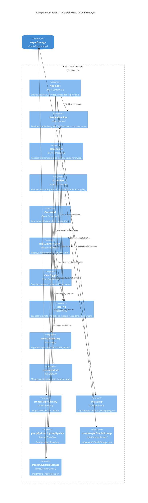

# Architecture Design: Grocery List UI + AsyncStorage Adapters

**Feature ID**: grocery-list-ui
**Wave**: DESIGN
**Date**: 2026-03-18
**Architect**: Morgan (Solution Architect)
**Builds on**: grocery-smart-list DESIGN wave (2026-03-17)

---

## Scope

This design covers the **UI shell and storage adapter layer** only. The domain layer (src/domain/, src/ports/, src/adapters/null/) is complete and tested. This document specifies how React components, hooks, and AsyncStorage adapters wire to the existing domain services.

---

## C4 Component Diagram (Level 3) -- UI Wiring Focus

The grocery-smart-list design already produced L1 and L2 diagrams. This L3 diagram focuses on the internal wiring between UI components, hooks, context, and domain services.



---

## React Component Tree and Navigation Structure

### Component Hierarchy

```
App (root)
  ServiceProvider (context provider -- StapleLibrary + TripService)
    AppShell
      ViewToggle (home | store)
      HomeView (visible when mode = 'home')
        AreaSection (per house area)
          TripItemRow (per item in area)
        QuickAdd
        TripSummaryView (visible after all areas complete)
      StoreView (visible when mode = 'store')
        AisleSection (per aisle/section group)
          TripItemRow (per item in aisle)
        QuickAdd
```

### Navigation Approach

No navigation library is needed for the initial scope. The app is a **single-screen app with view toggling**:

- ViewToggle switches between HomeView and StoreView
- Both views render the same trip data, grouped differently
- QuickAdd is present in both views
- TripSummaryView appears within HomeView after sweep completion

This matches the acceptance scenarios: "Switch to Store View" is a view toggle, not a screen navigation. If multi-screen navigation becomes needed (e.g., staple library management screen, trip history), React Navigation can be added later by the crafter without architectural changes.

---

## State Management Approach

### Decision: React Context + Custom Hooks (No State Library)

The state model is simple:
- One StapleLibrary service instance (created once at app start)
- One TripService instance (created once at app start)
- One view mode toggle (home | store)
- Derived state: grouped items (computed from trip items via pure functions)

This does not warrant Redux, Zustand, or any state management library. React Context provides the service instances; custom hooks expose state and trigger re-renders.

### State Flow

```
AsyncStorage
  --> adapters load data on app mount
    --> domain services initialized with adapters
      --> ServiceProvider holds service instances in context
        --> useTrip hook reads from TripService, manages React state for items
        --> useStapleLibrary hook reads from StapleLibrary, manages React state for search
          --> components consume hooks, render grouped views
```

### Reactivity Model

The domain services (createStapleLibrary, createTrip) are **imperative** -- they mutate internal state via method calls but do not notify listeners. The hooks bridge this gap:

1. Hook calls domain service method (e.g., `tripService.checkOff(name)`)
2. Hook immediately re-reads state from service (e.g., `tripService.getItems()`)
3. Hook updates React state, triggering re-render
4. AsyncStorage write happens in background (fire-and-forget for check-offs)

This is the **optimistic UI** pattern: React state updates instantly, storage write is async and non-blocking.

---

## Domain Service Injection

### Wiring Sequence (App Startup)

1. App root creates AsyncStorage adapters:
   - `createAsyncStapleStorage()` -- returns StapleStorage
   - `createAsyncTripStorage()` -- returns TripStorage

2. App root creates domain services with adapters:
   - `createStapleLibrary(stapleStorage)` -- returns StapleLibrary
   - `createTrip(tripStorage)` -- returns TripService

3. App root loads initial data:
   - `stapleStorage.loadAll()` -- populates staple library cache
   - `tripService.loadFromStorage()` -- restores active trip if one exists

4. App root wraps component tree in `ServiceProvider`, passing both services

5. Components consume services via `useTrip()` and `useStapleLibrary()` hooks

### Dependency Injection Pattern

The existing codebase already uses this pattern. The walking skeleton's `GroceryList` accepts an optional `storage` prop with a default production implementation. The new design scales this to two services via React Context instead of props, because:

- Multiple components need the same services (HomeView, StoreView, QuickAdd, TripSummaryView)
- Prop-drilling through the component tree is unnecessarily verbose
- Context makes services available anywhere in the subtree

For testing, the ServiceProvider accepts injected services (null adapters), exactly as the current GroceryList accepts an optional storage prop.

---

## Async vs Sync Port Mismatch

### Critical Design Point

The existing port interfaces (StapleStorage, TripStorage) are **synchronous**:
- `loadAll(): StapleItem[]` (not Promise)
- `save(item: StapleItem): void` (not Promise)
- `loadTrip(): Trip | null` (not Promise)

But AsyncStorage is **asynchronous** (returns Promises).

### Resolution Strategy

The AsyncStorage adapters must bridge this mismatch. Two viable approaches exist:

**Option A -- Async adapters with cached reads**: The adapter loads data from AsyncStorage into an in-memory cache on initialization (async). After initialization, all reads are synchronous from cache. Writes update cache immediately (sync return) and persist to AsyncStorage in background (fire-and-forget).

**Option B -- Change port signatures to async**: Modify ports to return Promises. This would require changes to domain services and all existing tests.

**Recommendation: Option A** -- it preserves the existing synchronous port contracts, requires zero changes to domain logic or tests, and naturally provides the optimistic UI pattern (fast in-memory reads, background writes). The tradeoff is that the adapter must be initialized asynchronously before use (handled by the app startup sequence with a loading state).

This decision should be captured in ADR-003.

---

## Loading State

The app requires an async initialization phase (loading data from AsyncStorage into adapter caches). During this phase, the UI should show a loading indicator. The app transitions to the main view only after both adapters are initialized.

Expected initialization time: < 500ms for < 50 KB of data. The 2-second app launch budget has ample margin.

---

## Quality Attribute Compliance

| Requirement | How This Design Achieves It |
|------------|---------------------------|
| Check-off < 100ms | useTrip updates React state immediately (optimistic), AsyncStorage write is background |
| View toggle < 200ms | groupByArea/groupByAisle are pure functions over in-memory items; no storage read on toggle |
| Suggestions < 300ms | useStapleLibrary.search calls in-memory staple library; no async operations |
| App launch < 2s | Parallel AsyncStorage reads for staple library + trip; loading state shown during init |
| Offline-first | All reads from in-memory cache; all writes to AsyncStorage; zero network calls |

---

## Directory Structure

```
src/
  domain/              # EXISTING - no changes
    types.ts
    staple-library.ts
    trip.ts
    item-grouping.ts
  ports/               # EXISTING - no changes
    staple-storage.ts
    trip-storage.ts
  adapters/
    null/              # EXISTING - no changes
      null-staple-storage.ts
      null-trip-storage.ts
    async-storage/     # NEW
      async-staple-storage.ts
      async-trip-storage.ts
  hooks/               # NEW
    useTrip.ts
    useStapleLibrary.ts
    useViewMode.ts
    useAppInitialization.ts
  ui/                  # NEW
    ServiceProvider.tsx
    AppShell.tsx
    HomeView.tsx
    StoreView.tsx
    QuickAdd.tsx
    TripSummaryView.tsx
    ViewToggle.tsx
    AreaSection.tsx
    AisleSection.tsx
    TripItemRow.tsx
    LoadingScreen.tsx
```

---

## Requirements Traceability

| Requirement | Component(s) |
|------------|-------------|
| US-07: Skip staple | HomeView, useTrip (skipItem/unskipItem) |
| US-08: Navigate areas | HomeView, AreaSection, useTrip (completeArea, getSweepProgress) |
| US-09: Auto-suggest | QuickAdd, useStapleLibrary (search) |
| US-10: Navigate sections | StoreView, AisleSection, useTrip (checkOff) |
| US-11: Trip summary | TripSummaryView, useTrip (getSummary) |
| NFR1: Offline-first | AsyncStorage adapters, cached reads |
| NFR2: Performance | Optimistic UI in useTrip, in-memory grouping |
| NFR3: Data integrity | Domain services (unchanged), adapter cache consistency |
