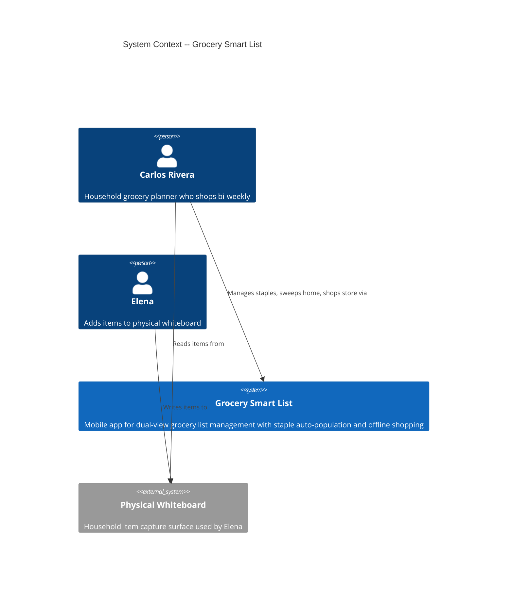
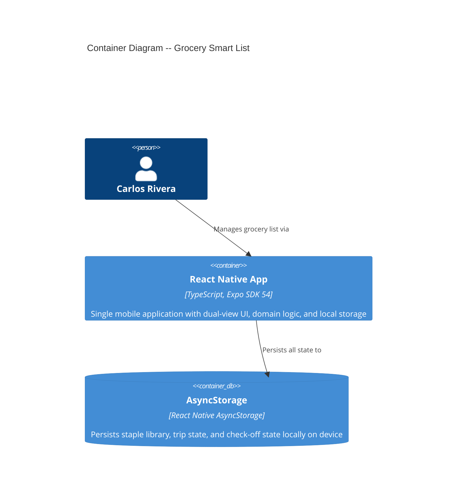
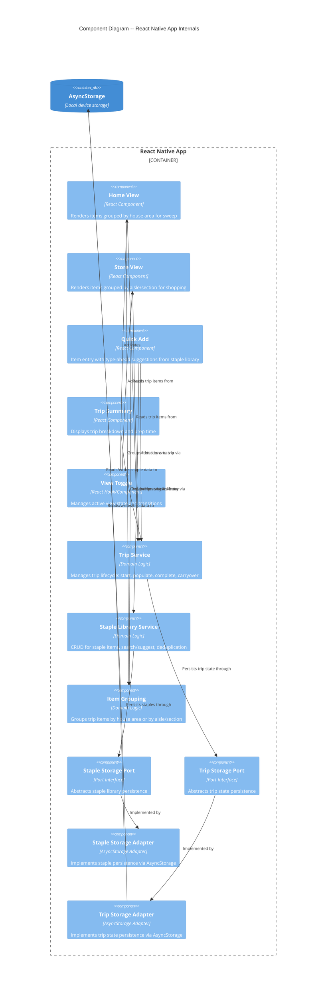

# Architecture Design: Grocery Smart List

**Feature ID**: grocery-smart-list
**Wave**: DESIGN
**Date**: 2026-03-17
**Architect**: Morgan (Solution Architect)

---

## System Context and Capabilities

The Grocery Smart List is a mobile application for a solo household grocery planner. It provides two views of the same shopping list -- organized by house area for home sweeps, and by store aisle/section for efficient shopping. All data is local-only with offline-first architecture. There are no external API integrations in the initial scope.

### Core Capabilities

1. **Staple Library Management** -- Define recurring items with persistent metadata (house area, store section, aisle)
2. **Trip Lifecycle** -- Start sweep, populate from staples, add items, switch to store view, check off, complete trip with carryover
3. **Dual-View Rendering** -- Same data, two groupings (area vs aisle), toggled manually
4. **Offline Persistence** -- All state persists to local storage, survives app restart, zero network dependency

---

## C4 System Context (Level 1)



Note: Elena does not interact with the app directly. Carlos consolidates whiteboard items into the app manually.

---

## C4 Container (Level 2)



This is deliberately simple. The entire system is a single mobile application with local storage. There are no backend services, no APIs, no cloud sync in the initial scope.

---

## C4 Component (Level 3)

The application has 5+ internal components with distinct responsibilities, warranting a component diagram.



---

## Component Architecture

### Domain Layer (no external dependencies)

| Component | Responsibility |
|-----------|---------------|
| **Staple Library Service** | Create, read, update, delete staple items. Search by prefix for suggestions. Prevent duplicates within same house area. |
| **Trip Service** | Start new trip (populate from staples). Add/remove items from trip. Check off/uncheck items. Complete trip with carryover logic. Track sweep progress. |
| **Item Grouping** | Pure functions that take a list of trip items and return grouped structures -- by house area or by aisle/section. No side effects. |

### Port Interfaces (abstractions)

| Port | Operations |
|------|-----------|
| **Staple Storage Port** | `loadAll`, `save`, `remove`, `search` |
| **Trip Storage Port** | `loadTrip`, `saveTrip`, `loadCheckoffs`, `saveCheckoffs` |

These follow the existing pattern established by `CheckedItemsStorage` -- factory functions returning objects that implement the interface, with null implementations for testing.

### Adapter Layer (infrastructure)

| Adapter | Technology | Purpose |
|---------|-----------|---------|
| **Staple Storage Adapter** | AsyncStorage | Persists staple library as JSON |
| **Trip Storage Adapter** | AsyncStorage | Persists active trip state and check-off state |
| **Null Staple Storage** | In-memory | Testing without AsyncStorage |
| **Null Trip Storage** | In-memory | Testing without AsyncStorage |

### UI Layer (React components)

| Component | View | Purpose |
|-----------|------|---------|
| **Home View** | Home | Renders items grouped by house area, sweep progress tracking |
| **Store View** | Store | Renders items grouped by aisle/section, section navigation, check-off |
| **Quick Add** | Both | Item entry with type-ahead from staple library |
| **Trip Summary** | Home | Post-sweep summary with breakdown and prep time |
| **View Toggle** | Both | Switch between home and store views |

---

## Architectural Style

**Style**: Ports-and-adapters (functional variant) within a single-process modular monolith.

**Rationale**: The existing codebase already implements this pattern using factory functions (`createCheckedItemsStorage`, `createNullCheckedItemsStorage`). This approach provides:
- High testability (domain logic tested without AsyncStorage)
- Clean separation of concerns (domain vs infrastructure)
- Zero operational overhead (single deployment)
- Matches the solo developer context (no distributed system complexity)

**Dependency Rule**: All dependencies point inward. Domain logic has zero imports from React Native, AsyncStorage, or any framework. UI components depend on domain services. Domain services depend on port interfaces. Adapters implement port interfaces.

```
UI Components --> Domain Services --> Port Interfaces <-- Adapters --> AsyncStorage
```

### Architecture Enforcement

Style: Ports-and-Adapters (functional)
Language: TypeScript
Tool: dependency-cruiser (MIT license, widely adopted, JSON/.dependency-cruiser.js config)

Rules to enforce:
- Domain modules (`src/domain/`) have zero imports from `src/adapters/`, `src/ui/`, `react-native`, `@react-native-async-storage`
- Port interfaces (`src/ports/`) have zero imports from adapter implementations
- No circular dependencies between any modules
- Adapter modules only import from ports and external libraries (never from UI)

---

## Development Paradigm

**Decision needed from developer**: Functional vs OOP internal style.

**Observation**: The existing codebase is already functional-style:
- React function components with hooks (no class components)
- Factory functions for ports (`createCheckedItemsStorage`) instead of classes
- No class keyword anywhere in the codebase
- CLAUDE.md mentions "functional, class-less style" (for pytest, but signals preference)

**Recommendation**: Continue with functional style. This means:
- Port interfaces defined as TypeScript interfaces with function signatures
- Adapters implemented as factory functions returning interface-conforming objects
- Domain logic as pure functions (item grouping, search, carryover calculations)
- State management via React hooks and context
- No class keyword in the codebase

The ports-and-adapters pattern works identically in functional style -- instead of injecting class instances, you inject factory-created objects or pass functions directly.

**This decision is captured in ADR-001.**

---

## Quality Attribute Strategies

### Offline-First (NFR1) -- Priority 1

- ALL data stored locally via AsyncStorage
- Zero network calls for any core functionality
- State persists across app restarts via AsyncStorage
- Check-off writes to storage on every toggle (fire-and-forget, no await blocking UI)
- Future cloud sync (out of scope) would be additive, not replacing local storage

### Performance (NFR2)

- **View toggle < 200ms**: Item grouping is a pure function over in-memory data. No storage reads on toggle -- trip items loaded once into React state, grouping computed on render.
- **Check-off feedback < 100ms**: Optimistic UI update (setState first, then async storage write). Visual feedback is immediate; persistence is background.
- **Suggestions < 300ms**: Staple library loaded into memory on app start. Search is in-memory prefix matching over a small dataset (< 100 items).
- **App launch < 2s**: Load staple library + active trip from AsyncStorage on mount. Two parallel reads.

### Data Integrity (NFR3)

- **No duplicates**: Staple library enforces uniqueness by name + house area combination
- **Staple library immutability during trip**: Trip completion operates on trip items only; staple library is read at trip start, never written during trip operations
- **Carryover correctness**: Trip completion produces a deterministic next-trip item list; unbought items carry over exactly once; domain logic is pure and testable

### Maintainability (ISO 25010)

- Ports-and-adapters separation enables changing storage technology without touching domain logic
- Pure domain functions are independently testable
- Small, focused modules with single responsibilities
- TypeScript strict mode catches errors at compile time

### Testability

- Domain services testable with null storage implementations (pattern already established)
- Pure grouping/carryover functions testable with zero mocking
- UI components testable via @testing-library/react-native with injected null services
- Architecture enforcement via dependency-cruiser prevents accidental coupling

### Security (Not Applicable)

Security is not a quality attribute driver for this feature. The app is:
- Local-only (no network calls, no API endpoints)
- Single-user (no authentication required for grocery list feature)
- On a personal device (physical security is the user's responsibility)
- No sensitive data (grocery items are not PII)

Firebase Auth exists in the codebase but is unused by this feature. If multi-user or cloud sync is added in future scope, a security review would be required at that time.

---

## Deployment Architecture

Single React Native app deployed via Expo/EAS Build:
- **Development**: Expo Go via `npm start`
- **Preview**: EAS Build preview profile for internal testing
- **Production**: EAS Build production profile

No backend infrastructure. No CI/CD pipeline changes needed beyond what is already configured.

---

## External Integrations

**None in initial scope.**

Firebase Auth exists in the codebase (`src/auth/AuthService.ts`) but is not used by the grocery list feature. If Firebase Auth is activated in future scope, it would be the only external integration and would require:
- Contract tests recommended for Firebase Auth API via Pact-JS to detect breaking changes
- Offline token caching strategy

---

## Directory Structure (Recommended)

```
src/
  domain/              # Pure business logic, zero external imports
    staple-library.ts  # Staple CRUD, search, deduplication
    trip.ts            # Trip lifecycle, carryover, check-off
    item-grouping.ts   # Group by area, group by aisle
    types.ts           # Domain types (Item, Trip, HouseArea, etc.)
  ports/               # Interface definitions (TypeScript interfaces)
    staple-storage.ts  # StapleStorage port interface
    trip-storage.ts    # TripStorage port interface
  adapters/            # Infrastructure implementations
    async-storage/
      staple-storage-adapter.ts
      trip-storage-adapter.ts
    null/              # Test doubles
      null-staple-storage.ts
      null-trip-storage.ts
  ui/                  # React components
    HomeView.tsx
    StoreView.tsx
    QuickAdd.tsx
    TripSummary.tsx
    ViewToggle.tsx
  hooks/               # React hooks for state management
    useTrip.ts
    useStapleLibrary.ts
  storage/             # (existing -- migrate to adapters/)
  auth/                # (existing -- keep for future scope)
```

Note: The existing `src/storage/CheckedItemsStorage.ts` and `src/components/GroceryList.tsx` will be superseded by the new structure. The walking skeleton code served its purpose and will be replaced incrementally.

---

## Requirements Traceability

| Requirement | Component(s) | Quality Attribute |
|------------|-------------|------------------|
| FR1: Item Management | Staple Library Service, Staple Storage Port/Adapter | Maintainability |
| FR2: Home View | Home View, Item Grouping, Trip Service | Performance (< 200ms) |
| FR3: Store View | Store View, Item Grouping, Trip Service | Performance (< 200ms) |
| FR4: View Toggle | View Toggle, Item Grouping | Performance (< 200ms) |
| FR5: Trip Lifecycle | Trip Service, Trip Storage Port/Adapter | Data Integrity |
| FR6: Quick-Add | Quick Add, Staple Library Service | Performance (< 300ms) |
| NFR1: Offline-First | All Storage Adapters (AsyncStorage) | Reliability |
| NFR2: Performance | Item Grouping (pure), Optimistic UI | Performance |
| NFR3: Data Integrity | Trip Service (carryover logic), Staple Library Service (dedup) | Reliability |
