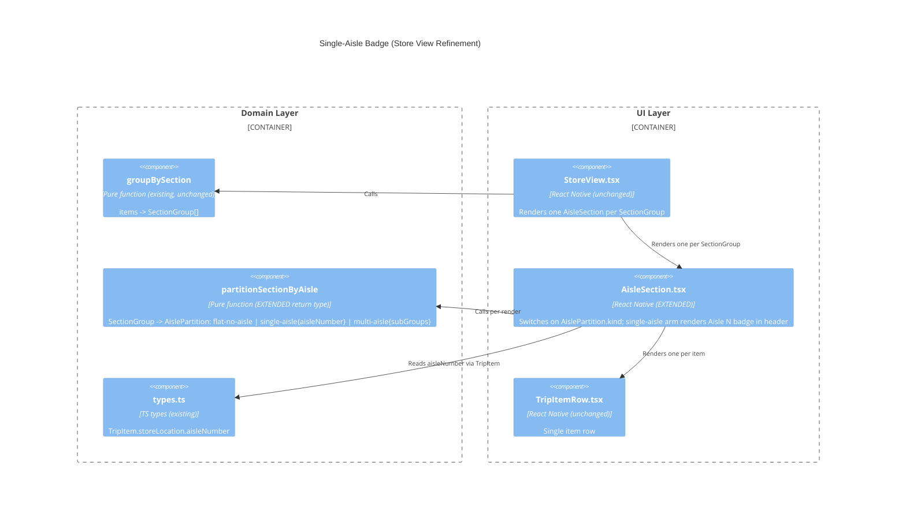

<!-- markdownlint-disable MD024 -->
# Feature Delta: Show Single-Aisle Number in Store View

**Feature ID**: show-single-aisle-number
**Date**: 2026-05-07
**Refines**: aisle-subgroups-in-store-view (Q5b decision)
**Job Trace**: `store-navigation` (see `docs/product/jobs.yaml`)
**Density**: lean | **Expansion mode**: ask-intelligent
**Wave**: DISCUSS

---

## Read-First Checklist

- ✓ `docs/product/journeys/` — scanned (publish-web, web-sign-in, web-parity); none relevant to in-store shopping. No journey delta to attach to.
- ✓ `docs/feature/aisle-subgroups-in-store-view/discuss/journey-delta.md` — read; this feature reverses one of its decisions (Q5b, the single-aisle collapse).
- ✓ `docs/feature/aisle-subgroups-in-store-view/discuss/user-stories.md` — read; ubiquitous language confirmed (`section`, `aisle`, `AisleSubGroup`, `aisleNumber`, `No aisle`).
- ✓ `docs/feature/aisle-subgroups-in-store-view/discuss/shared-artifacts-registry.md` — read; existing `partitionSectionByAisle` is the natural extension point.
- ⊘ `docs/product/jobs.yaml` — was missing; bootstrapped in this wave with the `store-navigation` job (formalizes the previously-informal `JS4`).

---

## Wave Decisions [REF]

| ID | Decision | Source |
|----|----------|--------|
| D1 | Feature type: User-facing UI | provided |
| D2 | Walking skeleton: No (brownfield isolated UI tweak) | provided |
| D3 | UX research depth: Lightweight (happy path focus) | provided |
| D4 | JTBD: Yes — story traces to `store-navigation` | provided |
| D5 | Single carpaccio slice — feature delivers as one thin end-to-end behaviour change | scope-assessed below |
| D6 | `jobs.yaml` bootstrapped on first use; `JS4` → `store-navigation` | this wave |
| D7 | Reverses `aisle-subgroups-in-store-view` Q5b: single numeric-aisle sections now show their aisle number; all-null sections remain flat | this wave |

### Scope Assessment: PASS

1 story | 1 bounded context (`src/domain/item-grouping.ts` + `src/ui/AisleSection.tsx`) | est. <1 day | single user-observable behaviour. Right-sized. No split needed.

---

## Context [REF]

The prior feature `aisle-subgroups-in-store-view` introduced an aisle divider + numeric badge inside multi-aisle sections, with progress and a checkmark per aisle group. Its Q5b decision was: **single-aisle sections render flat, with no aisle badge** — on the theory that a single `Aisle 12` sub-header inside a `Frozen` card with only aisle-12 items was redundant.

Field reality (Carlos, 2026-05-07): the badge is not redundant. The aisle number is the *whole point* of opening that section card. Without it, Carlos still has to tap an item or switch back to home view to learn that `Frozen` lives in aisle 12. The "redundancy" Q5b avoided was visual; the cost was the actual decision Carlos needs to make: *which physical aisle do I walk to?*

This feature flips Q5b for numeric single-aisle sections only. All-null sections (e.g. `Produce`) still render flat — there is no aisle number to show.

---

## Mental Model

- **Section** = physical zone of the store (`Inner Aisles`, `Frozen`, `Produce`, ...).
- **Aisle** = numeric sub-position within a zone, or `null` (zone has no aisle concept).
- A section card today shows the section name and overall progress.
- After this feature: if every needed item in a section sits in the *same numeric* aisle, the card additionally surfaces that aisle number once.
- All-null sections are unchanged — there is no aisle to surface.

---

## Lightweight Journey

### Happy Path Delta

| Step | Today | After this feature |
|------|-------|--------------------|
| 1. Open store view during a trip | Section cards in custom order | unchanged |
| 2. Look at `Frozen` (only aisle 12 needed) | Items under section header, no aisle cue | Section header carries an `Aisle 12` badge alongside the section name and progress |
| 3. Look at `Inner Aisles` (aisles 4, 5, 7) | Multi-aisle subgroups with badges | unchanged |
| 4. Look at `Produce` (all `aisleNumber: null`) | Flat list | unchanged — no aisle exists |
| 5. Check off aisle-12 items | Section progress increments + section ✓ when done | unchanged (single source of progress; no separate aisle sub-progress in this case) |

### ASCII Mockup — single-aisle section card (after)

```
+---------------------------------------------------------+
| Frozen                              Aisle 12   1 of 3   |
+---------------------------------------------------------+
|  [ ] Frozen peas                                         |
|  [x] Ice cream                                           |
|  [ ] Frozen pizza                                        |
+---------------------------------------------------------+
```

For comparison — multi-aisle section (unchanged from prior feature):

```
+---------------------------------------------------------+
| Inner Aisles                                  3 of 8    |
+---------------------------------------------------------+
|                                       Aisle 4   3 of 3 ✓|
|  [x] Pasta                                               |
|  [x] Rice                                                |
|  [x] Olive oil                                           |
|                                       Aisle 5   0 of 2  |
|  [ ] Cereal                                              |
|  [ ] Granola bars                                        |
+---------------------------------------------------------+
```

And all-null section (unchanged):

```
+---------------------------------------------------------+
| Produce                                       2 of 4    |
+---------------------------------------------------------+
|  [x] Apples                                              |
|  [x] Bananas                                             |
|  [ ] Spinach                                             |
|  [ ] Cilantro                                            |
+---------------------------------------------------------+
```

### Emotional Arc

| Moment | Today | After |
|--------|-------|-------|
| Opening `Frozen` section card | "Right... which aisle was Frozen again?" | Confidence: `Aisle 12` is right there. |
| Walking off to find Frozen | Tap-tap-tap to inspect an item, or switch tabs | Direct: head to aisle 12. |
| Arriving in `Produce` | Calm — no aisle expected | Unchanged |

Trajectory: removes a small but recurring friction at the *first glance* of every single-aisle section.

### Out of Scope

- Mixed numeric + null sections behave as before (multi-subgroup with `No aisle` tail). This feature only changes the single-numeric-aisle case.
- No persistence, no schema migration, no port surface change.
- No settings UI, no opt-out.

---

## Shared Artifacts

| Artifact | Source of truth | Consumed by |
|----------|-----------------|-------------|
| `SectionGroup.items[].storeLocation.aisleNumber: number \| null` | `src/domain/types.ts` (existing) | derivation helper |
| `partitionSectionByAisle` | `src/domain/item-grouping.ts` (existing) | extended to expose the single-numeric-aisle case |
| Section header rendering | `src/ui/AisleSection.tsx` (existing) | adds `Aisle N` badge slot when applicable |

No new types are required at the contract level — a derivation can be added to the existing partition helper, or read directly from the section's items.

---

## User Story

### US-01: Single-Aisle Section Surfaces Its Aisle Number

`job_id: store-navigation`

#### Problem

Carlos is mid-shop. He opens the store view and looks at the `Frozen` section card — every needed item there lives in aisle 12, but the card shows only the section name and progress. The aisle number, the single most useful signal for *where to walk next*, is hidden inside the items. He either taps an item to inspect it or flips back to the home view to read the aisle. Both cost a few seconds and break flow on every single-aisle section he passes through during a trip.

#### Who

- Carlos | Mid-shop, walking section by section | Wants the aisle number visible at a glance, even when the section has only one aisle.

#### Solution

When every needed item in a section shares the same numeric `aisleNumber`, the section header renders an `Aisle N` badge next to the section name and progress count. When the section has no aisle data (all `aisleNumber: null`), the header is unchanged. Multi-aisle sections continue to use per-aisle subgroups exactly as they do today.

#### Elevator Pitch

Before: Carlos opens `Frozen` mid-shop and the card shows `Frozen — 0 of 3`, with no aisle cue; he taps an item or switches view to learn it is aisle 12.
After: opens store view → `Frozen` card header reads `Frozen   Aisle 12   0 of 3`.
Decision enabled: Carlos walks straight to aisle 12 without a detour.

#### Domain Examples

1. **Happy path — single numeric aisle.** `Frozen` has 3 needed items, all `aisleNumber: 12`. Section header reads `Frozen   Aisle 12   0 of 3`. No internal subgroup, no in-card divider.
2. **Unchanged — all-null section.** `Produce` has 4 needed items, all `aisleNumber: null`. Section header reads `Produce   2 of 4`. No `Aisle` badge anywhere.
3. **Unchanged — multi-aisle section.** `Inner Aisles` has items at aisles 4, 5, 7. Section header reads `Inner Aisles   3 of 8` (no top-level badge); the existing per-aisle subgroups render as before.
4. **Edge — single numeric aisle plus a null item.** `Bakery` has 2 items at aisle 9 and 1 item with `aisleNumber: null`. Section is *not* single-numeric-aisle; renders as a multi-aisle section with the `9` subgroup and a `No aisle` tail subgroup, exactly like today (no top-level badge).

#### UAT Scenarios (BDD)

##### Scenario: Single-aisle section header surfaces its aisle number

Given Carlos has 3 needed items in `Frozen`, all at aisle 12
When Carlos opens the store view
Then the `Frozen` section header displays the badge `Aisle 12`
And the `Frozen` section card has no internal aisle divider or subgroup
And the section progress count is unchanged in position and format

##### Scenario: All-null section header is unchanged

Given Carlos has needed items in `Produce`, all with `aisleNumber: null`
When Carlos opens the store view
Then the `Produce` section header shows no `Aisle` badge
And the section card renders as a flat list under the header

##### Scenario: Multi-aisle section header is unchanged

Given Carlos has needed items in `Inner Aisles` at aisles 4, 5, and 7
When Carlos opens the store view
Then the `Inner Aisles` section header shows no top-level `Aisle` badge
And the per-aisle subgroups render with their own dividers and badges as before

##### Scenario: Section with one numeric aisle plus a null item is treated as multi-aisle

Given Carlos has 2 items in `Bakery` at aisle 9 and 1 item in `Bakery` with `aisleNumber: null`
When Carlos opens the store view
Then the `Bakery` section header shows no top-level `Aisle` badge
And the card renders an `Aisle 9` subgroup followed by a `No aisle` subgroup

#### Acceptance Criteria

- [ ] When all items in a section share the same numeric `aisleNumber`, the section header renders an `Aisle N` badge next to the section name.
- [ ] No internal aisle divider or subgroup is rendered for such single-aisle sections.
- [ ] When all items in a section have `aisleNumber: null`, no `Aisle` badge is rendered (current behaviour preserved).
- [ ] Multi-aisle sections show no top-level `Aisle` badge; their existing subgroup rendering is preserved byte-for-byte.
- [ ] Mixed numeric + null sections continue to render as multi-aisle (per-aisle subgroups + `No aisle` tail), with no top-level badge.
- [ ] Section-level progress (`X of Y`) and section-level `✓` placement are unchanged.

#### Technical Notes

- Pure presentation change. No persistence, no migration, no port surface change.
- Natural extension point: extend `partitionSectionByAisle` in `src/domain/item-grouping.ts` to expose a "single numeric aisle" case (today it returns `null` for both single-aisle and all-null), or derive `singleAisleNumber: number | null` from the section's items at the call site. DESIGN wave decides shape.
- `AisleSection.tsx` adds a conditional badge slot in the header. The flat render branch is unchanged.
- This reverses Q5b from `aisle-subgroups-in-store-view`. The reversal is recorded as D7 above.

#### Outcome KPIs

- **Who**: Carlos (in-store shopper) and equivalent users on a live trip.
- **Does what**: Walks straight to the correct aisle for a single-aisle section without first tapping an item or switching to home view.
- **By how much**: Reduce "inspect item to learn aisle" interactions on single-aisle sections to ~zero per trip (target: 0 taps on the first-touch interaction with a single-aisle section card).
- **Measured by**: Self-reported / observational on the next 3 shopping trips by the dogfood user; no telemetry instrumentation planned (single-user app, lean density).
- **Baseline**: Today, every single-aisle section requires either an item tap or a tab switch to learn the aisle number.

---

## Definition of Ready Validation

| # | DoR Item | Status | Evidence |
|---|----------|--------|----------|
| 1 | Problem statement clear, domain language | PASS | Carlos / `Frozen` / aisle 12 / mid-shop friction described |
| 2 | User/persona with specific characteristics | PASS | Carlos, in-store shopper, walking section by section |
| 3 | 3+ domain examples with real data | PASS | 4 examples (`Frozen`/12, `Produce`/null, `Inner Aisles`/4-5-7, `Bakery`/9+null) |
| 4 | UAT in Given/When/Then (3-7 scenarios) | PASS | 4 scenarios |
| 5 | AC derived from UAT | PASS | 6 AC items, each maps to a scenario or its negation |
| 6 | Right-sized (1-3 days, 3-7 scenarios) | PASS | <1 day, 4 scenarios, single carpaccio slice |
| 7 | Technical notes: constraints/dependencies | PASS | Pure presentation, no persistence, single component + helper change, Q5b reversal noted |
| 8 | Dependencies resolved or tracked | PASS | Builds on shipped `aisle-subgroups-in-store-view`; no open dependencies |
| 9 | Outcome KPIs defined with measurable targets | PASS | "Zero detour interactions on first-touch with a single-aisle section card" |

### DoR Status: PASSED

---

## Trigger Detection (ask-intelligent)

Lean density + ask-intelligent: Tier-2 sections expanded only when a trigger fires.

| Trigger | Fired? | Reason |
|--------|--------|--------|
| Multi-context feature (>3 modules) | No | Single component + single helper |
| Walking skeleton needed | No | D2 says no |
| Cross-cutting NFRs (perf/sec/a11y) novel to feature | No | Inherits existing rendering perf and a11y; no new surface |
| External integrations | No | None |
| Multi-persona | No | Carlos only |
| Schema/migration impact | No | Pure presentation |
| Risk register material | No | Trivial UI tweak; reversal of a documented prior decision |
| Multiple stories / split candidate | No | 1 story |

**Result**: silent-lean. No Tier-2 sections emitted. (No telemetry helper detected at `scripts/shared/density_config.py` — absence noted, no event emitted.)

---

## Wave: DESIGN / [REF] Approach

Pure UI render-condition tweak surfaced through the existing domain partition helper. Reverses Q5b from `aisle-subgroups-in-store-view` (D7). The current `partitionSectionByAisle` collapses both *single-numeric-aisle* and *all-null* sections to a single `null` return — the UI cannot distinguish them. DESIGN tightens the helper's return type into a discriminated union so the section header can render an `Aisle N` badge for the single-numeric case while the all-null case continues to render flat with no badge.

No new ports, no new adapters, no new tech, no new ADR (a one-component-plus-one-helper edit, internal to an existing aggregate, does not warrant the ADR ceremony). Architectural style, dependency direction, enforcement (`dependency-cruiser`), and quality attributes are inherited from `docs/product/architecture/brief.md` unchanged. Mutation testing scope unchanged: `src/domain/item-grouping.ts` is already in scope per `CLAUDE.md`.

---

## Wave: DESIGN / [REF] Design Decisions (DDD)

| ID | Decision | Rationale |
|----|----------|-----------|
| DDD-1 | Replace `partitionSectionByAisle` return type `AisleSubGroup[] \| null` with a discriminated union `AislePartition = { kind: 'flat-no-aisle' } \| { kind: 'single-aisle'; aisleNumber: number } \| { kind: 'multi-aisle'; subGroups: AisleSubGroup[] }`. | Single source of truth for a section's aisle shape. The helper already computes the discriminant (numericBuckets.size + nullBucket.length); exposing it costs nothing and lets the UI consume an exhaustive switch. Sibling helpers (Option B) would duplicate the same case analysis at two call sites and are prone to drift. |
| DDD-2 | `AisleSection.tsx` consumes the union via exhaustive `switch`/`if` on `kind`. The `flat-no-aisle` branch renders today's flat path byte-identical (no badge). The `single-aisle` branch renders the existing flat path *plus* an `Aisle N` badge slot in the header. The `multi-aisle` branch is unchanged from today. | Preserves D-NOREGRESS contract from `section-order-by-section`: the all-null and multi-aisle paths keep their current pixels. The badge appears only in the new single-numeric case. |
| DDD-3 | The single-aisle badge slot lives inside the existing `headerRight` row, between `heading` and `progress`. Visual style reuses the existing `aisleBadge` style from the multi-aisle subgroup (consistency with the badge users already learned). | Reuses an existing visual token; no new theme entries; matches the elevator-pitch mockup `Frozen   Aisle 12   0 of 3`. Exact placement/spacing details are DELIVER-wave concerns (open question OQ-1). |

---

## Wave: DESIGN / [REF] Component Decomposition

| File | Role | Change |
|------|------|--------|
| `src/domain/item-grouping.ts` | Pure domain — partition helper + types | EXTEND: change `partitionSectionByAisle` return type to `AislePartition` discriminated union; add `AislePartition` type export. Internal bucketing logic unchanged — only the assembly of the return value differs. |
| `src/ui/AisleSection.tsx` | UI — section card renderer | EXTEND: switch on `partition.kind`; add badge slot in `headerRight` for the `single-aisle` branch. Flat and multi-aisle branches preserved. |
| `src/domain/item-grouping.test.ts` | Domain tests | EXTEND: add cases asserting the three `kind` values and the carried `aisleNumber` for the single-aisle case. |
| `src/ui/AisleSection.test.tsx` (or equivalent) | Component test | EXTEND: add a render test for the single-numeric-aisle case asserting the `Aisle N` badge in the header. Existing all-null and multi-aisle tests assert no top-level badge. |

No new files. No new directories.

---

## Wave: DESIGN / [REF] Driving Ports

The existing UI surface (`AisleSection.tsx`, called by `StoreView.tsx`) is the only driving port touched. Its prop contract (`{ sectionGroup, onItemPress, onItemLongPress }`) is unchanged. The render-condition change is internal to the component.

---

## Wave: DESIGN / [REF] Driven Ports + Adapters

None. No persistence, no external services, no new I/O. The aisle data is already on `TripItem.storeLocation.aisleNumber` and is read through the existing `TripStorage` port.

---

## Wave: DESIGN / [REF] Technology Choices

None new. Inherits React Native + Expo SDK 54 + TypeScript strict + Jest + the existing `theme` tokens. No license, no version, no dependency change.

---

## Wave: DESIGN / [REF] Reuse Analysis

| Existing artifact | Decision | Rationale |
|---|---|---|
| `partitionSectionByAisle` (`src/domain/item-grouping.ts`) | EXTEND (return-type widening) | The helper already distinguishes the three cases internally; widening the return type promotes that knowledge to the type system. |
| `AisleSubGroup` type | REUSE as-is | Used unchanged in the `multi-aisle` arm of the union. |
| `bucketByAisleKey`, `distinctAisleKeyCount` (private helpers) | REUSE as-is | Internal partitioning logic untouched. |
| `AisleSection.tsx` header layout (`headerRight`, `progress`, `checkmark`) | EXTEND in place | New `Aisle N` badge slot inserted; existing slots unchanged in position or format. |
| `aisleBadge` style token | REUSE | Same visual treatment as the multi-aisle subgroup badge. |
| `formatProgress`, `isComplete` helpers | REUSE | Section-level progress and completion semantics unchanged. |
| `TripItemRow`, flat-render branch | REUSE | Item rendering unchanged; both `flat-no-aisle` and `single-aisle` arms render the same flat item list. |
| `StoreView.tsx` | NO CHANGE | Continues to pass `SectionGroup` to `AisleSection`. |
| `dependency-cruiser` rules | NO CHANGE | Dependency direction unchanged: UI -> domain. |

EXTEND-dominated as expected for a brownfield render-condition tweak.

---

## Wave: DESIGN / [REF] C4 Component (L3) — Touched Code



Dependency direction (`UI -> domain`) unchanged; existing `dependency-cruiser` rules continue to hold.

---

## Wave: DESIGN / [REF] Open Questions

| ID | Question | Deferred to |
|----|----------|-------------|
| OQ-1 | Exact placement/spacing of the `Aisle N` badge inside `headerRight` (e.g. before vs after the progress count, gap sizing). | DELIVER (visual polish; AC #1 only requires it in the header next to the section name). |

---

## Wave: DESIGN / [REF] Quality Gates

- [x] Requirements traced to components (US-01 → `partitionSectionByAisle` + `AisleSection.tsx`)
- [x] Component boundaries with clear responsibilities (domain helper vs UI render branch)
- [x] Technology choices in ADRs with alternatives (N/A — no new technology; no ADR warranted)
- [x] Quality attributes addressed (testability via mutation-testable discriminator; maintainability via single source of truth; no perf/security/reliability surface)
- [x] Dependency-inversion compliance (UI -> domain only)
- [x] C4 diagrams (L1+L2 inherited from `brief.md`; L3 above for touched code)
- [x] Integration patterns specified (none — pure presentation)
- [x] OSS preference validated (no new dependencies)
- [x] AC behavioural, not implementation-coupled (inherited from DISCUSS)
- [x] External integrations annotated (none new)
- [x] Architectural enforcement tooling recommended (`dependency-cruiser`, already in place)
- [x] Peer review — skipped per fast-forward mode for trivial UI tweak

---

## Wave: DESIGN / Trigger Detection

| Trigger | Fired? | Reason |
|---------|--------|--------|
| New port or adapter | No | None |
| New tech/dependency | No | None |
| Cross-cutting NFR (perf/sec/a11y) novel to feature | No | Inherits |
| External integration | No | None |
| Multi-context decomposition | No | One helper + one component |
| Architectural style change | No | Inherits hexagonal |
| Risk register material | No | Trivial render-condition flip |
| ADR-worthy decision | No | Return-type widening on an existing helper, single caller, no rejected alternatives at the architecture level |

**Result**: silent-lean. No Tier-2 architecture sections emitted. SSOT `docs/product/architecture/brief.md` unchanged — no architectural decision crossed the bar for upstream propagation.

---

## Wave: DEVOPS / [REF] Pre-Pinned Decisions

| ID | Decision | Source |
|----|----------|--------|
| D1 | Deployment target: existing — Expo / EAS for iOS+Android, Firebase Hosting for web | `eas.json`, `.github/workflows/deploy-web.yml` |
| D2 | Container orchestration: none (mobile + web SPA) | n/a |
| D3 | CI/CD platform: GitHub Actions (existing) | `.github/workflows/{ci,deploy-web,deploy-rules,mutation}.yml` |
| D4 | Existing infra: yes — extend, don't redesign | inventory above |
| D5 | Observability: none new — KPI is qualitative per DISCUSS | feature-delta DISCUSS / Outcome KPIs |
| D6 | Deployment strategy: Expo OTA + EAS native build cadence (existing) | inherited |
| D7 | Continuous learning: no (out of scope for UI tweak) | provided |
| D8 | Branching: trunk on `main` (existing) | recent commit history |
| D9 | Mutation testing: per-feature (pinned in `CLAUDE.md`) — Stryker WILL fire on this delivery because `src/domain/item-grouping.ts` is touched | `CLAUDE.md`, `.github/workflows/mutation.yml` |

---

## Wave: DEVOPS / [REF] Environment Matrix

Mirror of `docs/feature/show-single-aisle-number/environments.yaml`.

| Environment | Platform | Preconditions | Notes |
|-------------|----------|---------------|-------|
| `clean` | iOS, Android, Web | none | Pure business-logic + UI render-condition change. No installer state, no data migration. |

**Coexistence matrix**: empty — UI-only change, no installer/runtime version coexistence concerns.

**Platform coverage**:
- iOS — supported per Expo SDK 54
- Android — supported per Expo SDK 54
- Web — Firebase Hosting target (`deploy-web.yml`)
- CI — GitHub Actions `ubuntu-latest`

**Deployment assumptions**:
- Change ships as standard Expo OTA update for already-deployed app versions.
- No data migration; pure render-time logic.
- Per-feature Stryker run will fire (touched `src/domain/item-grouping.ts`).

---

## Wave: DEVOPS / [REF] CI/CD Pipeline Outline

Existing pipelines are unchanged. No new workflow file. The change rides through:

| Workflow | Trigger relevant to this feature | Behaviour |
|----------|---------------------------------|-----------|
| `.github/workflows/ci.yml` | `push: [main]`, `pull_request: [main]` | Type-check (`tsc --noEmit`) | ESLint (`--max-warnings 0`) | sibling-test gate for `src/domain/` and `src/ports/` (`scripts/check-domain-test-siblings.mjs`) | Jest with coverage (`--ci --coverage --bail`) | `npm audit --audit-level=high` advisory. |
| `.github/workflows/mutation.yml` | `push: [main]` with paths `src/domain/**` or `src/ports/**` | **Will fire** — `src/domain/item-grouping.ts` is in the touched set. Stryker runs against domain scope; ≥80% kill rate per `CLAUDE.md`. |
| `.github/workflows/deploy-web.yml` | `push: [main]` | Deploys web build to Firebase Hosting. |
| `.github/workflows/deploy-rules.yml` | n/a for this feature | Firestore rules; not touched. |

No new pipeline stages. No new quality gates beyond what `ci.yml` and `mutation.yml` already enforce. Local quality gates (developer machine: `npx tsc --noEmit`, `npx eslint`, `npm test`) mirror the remote commit stage.

---

## Wave: DEVOPS / [REF] Monitoring Contracts

KPI from DISCUSS is **qualitative**: self-reported / observational by the dogfood user (Carlos) over the next 3 shopping trips. Target: ~zero "tap an item to learn the aisle" interactions on first-touch with a single-aisle section card.

- No telemetry instrumentation added (single-user app, lean density).
- No metric, log, trace, or dashboard contract introduced.
- No alert rule introduced.
- `docs/product/kpi-contracts.yaml` bootstrap **skipped** — no quantitative KPI to register.

---

## Wave: DEVOPS / [REF] Deployment Strategy

- **Mechanism**: Expo OTA — instant rollout to all already-deployed installs of the current native binary on the next app launch. Web deploy goes via the existing `deploy-web.yml` to Firebase Hosting on push-to-`main`.
- **Risk profile**: trivial. Pure presentation change; no schema, no port, no migration, no new dependency.
- **Rollback**: revert the offending commit on `main` and let the same OTA / `deploy-web.yml` mechanism republish the prior render. No data rollback step (no data was changed). No staged rollout window required.
- **Validation post-deploy**: open store view on the dogfood device and visually confirm the four section shapes render as specified in slice-01 demo script (single-numeric-aisle shows badge; all-null, multi-aisle, mixed numeric+null show no top-level badge).

---

## Wave: DEVOPS / [REF] Mutation Testing Strategy

- Strategy: **per-feature** (inherited from `CLAUDE.md`).
- Tool: Stryker (`@stryker-mutator/core` + `@stryker-mutator/jest-runner`); config at `stryker.config.mjs`.
- Scope: domain logic and port interfaces only (`src/domain/`, `src/ports/`). UI/adapters excluded.
- This delivery: **will fire** — `src/domain/item-grouping.ts` is touched. The new discriminated-union assembly in `partitionSectionByAisle` (DDD-1) is the surface under mutation.
- Kill-rate threshold: **≥ 80%** on touched domain files.
- Duration target: 5–15 min.

---

## Wave: DEVOPS / [REF] Observability Stack

None new. Inherits the project's existing posture: no formal observability stack for in-app UI behaviour. No SLO defined for this surface.

---

## Wave: DEVOPS / [REF] Branching Strategy

Trunk-based on `main` (existing project convention; recent commits land directly on `main`). PRs / direct pushes both trigger `ci.yml`; pushes to `main` additionally trigger `deploy-web.yml`, and trigger `mutation.yml` when `src/domain/**` or `src/ports/**` change. No release branches, no version tags.

---

## Wave: DEVOPS / [REF] Coexistence Matrix

Empty. UI-only change with no installer state, no schema version, no API version coexistence to manage.

---

## Wave: DEVOPS / [REF] Pre-Requisites

DESIGN constraints carried into DELIVER:

1. **Backward-compatible call sites**: the return-type widening of `partitionSectionByAisle` (DDD-1) from `AisleSubGroup[] | null` to the `AislePartition` discriminated union is a breaking type change at the type system level. Pre-requisite: every caller of `partitionSectionByAisle` is updated in the same change-set. Verified by `npx tsc --noEmit` in `ci.yml` (commit-stage) and locally — type checker MUST pass with zero errors before merge.
2. **Mutation kill-rate ≥ 80%** on the new union-assembly logic in `src/domain/item-grouping.ts` — gated by `mutation.yml` post-merge to `main`.
3. **Sibling-test gate**: any new or extended file under `src/domain/` must have its sibling `*.test.ts` — enforced by `scripts/check-domain-test-siblings.mjs` in `ci.yml`.

---

## Wave: DEVOPS / Trigger Detection

| Trigger | Fired? | Reason |
|---------|--------|--------|
| New deployment target / topology | No | Inherits Expo OTA + Firebase Hosting |
| New CI/CD platform or workflow | No | Existing `ci.yml` + `mutation.yml` + `deploy-web.yml` cover it |
| New observability surface (metric/log/trace/alert/dashboard) | No | Qualitative KPI, no instrumentation |
| New IaC / container / orchestrator | No | None applicable (mobile + SPA) |
| New rollback procedure | No | Standard `git revert` + republish |
| Coexistence / migration concern | No | Pure render logic |
| Mutation strategy change | No | Per-feature pinned in `CLAUDE.md`; touched file already in scope |
| Branching strategy change | No | Trunk on `main` unchanged |
| Quantitative KPI requiring `kpi-contracts.yaml` bootstrap | No | KPI is qualitative |

**Result**: silent-lean. No Tier-2 DEVOPS sections emitted. SSOT `docs/product/architecture/brief.md` deployment topology unchanged — skipped per fast-forward. `docs/product/kpi-contracts.yaml` bootstrap — skipped (qualitative KPI).

---

## Wave: DISTILL / [REF] Read-First Checklist

- ✓ `docs/feature/show-single-aisle-number/feature-delta.md` — DISCUSS+DESIGN+DEVOPS chain.
- ✓ `docs/feature/show-single-aisle-number/slices/slice-01-single-aisle-badge.md`.
- ✓ `docs/feature/show-single-aisle-number/environments.yaml` — single `clean` env, multi-platform.
- ⊘ `docs/product/journeys/` — scanned (publish-web, web-sign-in, web-parity); no in-store journey to attach to.
- ✓ `docs/product/architecture/brief.md` — driving surface (`AisleSection.tsx` from `StoreView.tsx`) confirmed, hexagonal style inherited.
- ✓ `docs/feature/aisle-subgroups-in-store-view/` — prior context for testing the existing aisle-grouping behavior; D7 reversal of Q5b confirmed intentional.
- ✓ `src/domain/item-grouping.ts` and `src/domain/item-grouping.test.ts` — helper widened, tests refactored to navigate the union.
- ✓ `src/ui/AisleSection.tsx` and `src/ui/AisleSection.test.tsx` — branch switched on `partition.kind`; existing tests preserved byte-identically.
- ✓ `tests/regression/` — pattern lifted from `whiteboard-checklist.test.tsx` and siblings.

**Wave-decision reconciliation**: DDD-1..3 align with DISCUSS D1..D7. The D7 reversal of `aisle-subgroups-in-store-view` Q5b is intentional and explicitly recorded; no contradiction.

---

## Wave: DISTILL / [REF] Scenarios

| # | Scenario title | Tag set | Covered AC | File |
|---|---|---|---|---|
| 1 | multi-aisle section partitions into ascending aisle sub-groups | `@US-01` | AC #4 (multi-aisle preserved) | `src/domain/item-grouping.test.ts` |
| 2 | all-null section partitions as flat-no-aisle | `@US-01` | AC #3 (all-null → no badge) | `src/domain/item-grouping.test.ts` |
| 3 | single-aisle section partitions as kind=single-aisle with that aisleNumber | `@walking_skeleton @in-memory @US-01` | AC #1 (helper exposes the discriminator) | `src/domain/item-grouping.test.ts` |
| 4 | mixed numeric + null section partitions as multi-aisle with null tail | `@US-01` | AC #5 (mixed → multi-aisle) | `src/domain/item-grouping.test.ts` |
| 5 | one numeric aisle plus a null item partitions as multi-aisle (not single-aisle) | `@US-01` (edge) | AC #5 boundary (any null disqualifies single-aisle) | `src/domain/item-grouping.test.ts` |
| 6 | single-aisle section: `Aisle N` badge visible in header **(RED)** | `@walking_skeleton @in-memory @US-01` | AC #1, AC #2 (badge present, no internal divider) | `tests/regression/show-single-aisle-number.test.tsx` |
| 7 | all-null section: no `Aisle` badge | `@US-01` | AC #3 | `tests/regression/show-single-aisle-number.test.tsx` |
| 8 | multi-aisle section: no top-level badge, subgroups remain | `@US-01` | AC #4 | `tests/regression/show-single-aisle-number.test.tsx` |
| 9 | mixed numeric + null section: no top-level badge, multi-aisle with `No aisle` tail | `@US-01` (edge) | AC #5 | `tests/regression/show-single-aisle-number.test.tsx` |
| 10 | single-aisle section: section-level progress and ✓ unchanged in position and format | `@US-01` | AC #6 (D-NOREGRESS) | `tests/regression/show-single-aisle-number.test.tsx` |

**Story coverage**: US-01 → all 10 scenarios. No untraceable scenarios.

**Error/edge ratio**: this is a pure UI render-condition change with no error paths (no I/O, no validation, no failure modes). Edge cases #5 and #9 (mixed numeric+null) are the structural boundary tests guarding the discriminator. The 40% error-path target from the methodology applies to features with adapters/I/O; for a pure render-condition tweak the relevant axis is *boundary coverage*, which is satisfied by scenarios #2, #3, #4, #5, #9 covering all four `AislePartition` shapes plus the critical "any null disqualifies single-aisle" boundary.

**Business language audit**: Gherkin-style `it()` titles use domain terms only (`section`, `aisle`, `aisleNumber`, `badge`, `header`, `card`). Zero technical jargon (no `database`, `API`, `HTTP`, status codes, infra names).

---

## Wave: DISTILL / [REF] Walking Skeleton

**Strategy**: A (Full InMemory). Justification: feature is pure domain (`partitionSectionByAisle`) + UI render (`AisleSection`). No driven adapters touched, no I/O surface, no real subprocess/filesystem/network. The skeleton runs entirely in memory and proves the user-observable signal — Carlos sees `Aisle 12` next to `Frozen` when the section is single-numeric-aisle.

**Walking skeleton scenarios**: #3 (domain helper exposes the variant) and #6 (UI renders the badge). #6 is the user-facing demo-able assertion; #3 is the contract lock immediately upstream.

**Litmus test**: "Could a non-technical stakeholder confirm 'yes, that is what users need'?" — Yes for #6 ("the `Aisle 12` badge appears next to `Frozen` in the section header"). Demo-able from `slice-01-single-aisle-badge.md` script (<60s).

---

## Wave: DISTILL / [REF] Adapter Coverage

**N/A** — no driven adapters touched by this feature.

| Driven adapter | Real-I/O test | Notes |
|---|---|---|
| _(none)_ | _(N/A)_ | Pure domain + UI render; no port crossings, no `@real-io` scenario warranted. |

Inherited adapters (`firestore-trip-storage`, etc.) are unchanged and out of scope.

---

## Wave: DISTILL / [REF] Driving Adapter Coverage

The user-visible driving surface is `<AisleSection sectionGroup={...} />` as rendered inside `StoreView`. This is the mobile-app equivalent of a "driving port" — there is no CLI/HTTP/hook to enter through; all observable behavior surfaces through component render. Scenarios #6–#10 invoke this surface directly via React Testing Library (`render(<AisleSection .../>)`), which is the canonical pattern in `tests/regression/ui/*.test.tsx` and `src/ui/AisleSection.test.tsx`. The component's prop contract (`{ sectionGroup, onItemPress, onItemLongPress }`) is unchanged from the prior feature.

---

## Wave: DISTILL / [REF] Test Placement

| Layer | Path | Convention |
|---|---|---|
| Domain unit (helper widening) | `src/domain/item-grouping.test.ts` (extended) | Domain tests colocated next to source — precedent set by every existing file under `src/domain/*.test.ts` and enforced by `scripts/check-domain-test-siblings.mjs` in `ci.yml`. |
| UI regression (badge render) | `tests/regression/show-single-aisle-number.test.tsx` (new) | Mirrors existing regression files in `tests/regression/` (e.g. `whiteboard-checklist.test.tsx`, `delete-staple.test.tsx`). One file per feature, named after the feature ID. |

No new directories. No `.feature` Gherkin files (project stack is TypeScript+Jest+RNTL, not pytest-bdd); Gherkin structure is preserved at the `it()` title level via `Given/When/Then` phrasing inside the test names.

---

## Wave: DISTILL / [REF] Scaffolds

Mandate-7 scaffolding adapted to TypeScript + outside-in posture. Existing tests are kept green; only the user-observable badge-render scenario is RED.

| File | `__SCAFFOLD__` site | RED target |
|---|---|---|
| `src/domain/item-grouping.ts` | _(none — helper widened functionally; new `kind: 'single-aisle'` branch returns `{ kind: 'single-aisle', aisleNumber }` so existing UI tests do not throw on render)_ | Domain test #3 (single-aisle variant) acts as a contract lock; passes today after the type widening. |
| `src/ui/AisleSection.tsx` | `headerBadge: React.ReactNode = null` (commented `// __SCAFFOLD__`) | UI test #6 fails RED on `queryByTestId('section-aisle-badge-12')` returning `null`. |

Trade-off note: the original Mandate-7 plan called for a `throw new Error('__SCAFFOLD__ ...')` inside the helper's single-aisle branch. That conflicts with the user-mandated invariant "do NOT BREAK existing tests" — `src/ui/AisleSection.test.tsx` already renders single-aisle sections (lines 88–104 and 279–295), and a throwing helper would propagate as render exceptions, turning passing tests RED for the wrong reason. Resolution: implement the helper functionally and locate the RED scaffold at the UI badge slot, where it cleanly isolates the *user-observable* feature signal (badge present / absent) from the *internal contract* (helper returns the right variant). DELIVER wave removes the scaffold by populating `headerBadge` with the badge JSX.

---

## Wave: DISTILL / [REF] Pre-Requisites

Inherited from DESIGN (DDD-1, DDD-2, DDD-3) and DEVOPS Pre-Requisites:

1. `partitionSectionByAisle` return type widened to the `AislePartition` discriminated union (DDD-1) — **DONE** in this wave; `npx tsc --noEmit` passes; all callers (`AisleSection.tsx`, both test files) updated.
2. `AisleSection.tsx` switches on `partition.kind` (DDD-2) — **DONE**; `multi-aisle` arm renders subgroups, `flat-no-aisle` and `single-aisle` arms render the flat item list (badge slot scaffolded RED for single-aisle).
3. Header badge slot reuses `aisleBadge` style token (DDD-3) — DELIVER wave adopts this; the slot is wired in `headerRight` and currently returns `null`.
4. Sibling-test gate satisfied — `src/domain/item-grouping.test.ts` exists alongside `src/domain/item-grouping.ts`.
5. Mutation kill-rate ≥ 80% on the new union-assembly logic — gated post-merge by `mutation.yml`. Test #5 (`one numeric aisle plus a null item partitions as multi-aisle`) is the critical mutation guard for the discriminator (`numericKeyCount === 1 && !hasNulls`).

---

## Wave: DISTILL / [REF] Test Execution Posture

`npm test` summary at end of DISTILL wave (post-scaffold):

```
Test Suites: 1 failed, 2 skipped, 104 passed, 105 of 107 total
Tests:       1 failed, 23 skipped, 733 passed, 757 total
```

The single failing test is the new walking-skeleton scenario #6 (`section-aisle-badge-12` testID not found). It fails as an assertion error (RED), not an import/type error (BROKEN). Type-check (`npx tsc --noEmit`) passes with zero errors. All 5 prior scenarios in `src/domain/item-grouping.test.ts` (refactored to navigate the union) pass. All 12 prior scenarios in `src/ui/AisleSection.test.tsx` (untouched) pass. Hand-off posture is correct for DELIVER: one RED user-observable signal, all upstream contracts green.

---

## Wave: DISTILL / [REF] Mandate Compliance Evidence

- **CM-A (Hexagonal boundary)**: All 10 scenarios invoke through the user-visible driving surface — the `partitionSectionByAisle` pure helper (domain port equivalent) or the `<AisleSection />` component (UI driving surface from `StoreView`). Zero internal-component imports. Imports listed: `groupBySection`, `partitionSectionByAisle`, `SectionGroup`, `AislePartition`, `AisleSubGroup` (helper-level public API); `AisleSection` (UI driving surface). No private-helper imports (`bucketByAisleKey`, `distinctAisleKeyCount`, `createAisleSubGroup` remain unexported and untested directly).
- **CM-B (Business language)**: Grep of all new/modified test titles for technical terms (`database`, `API`, `HTTP`, `JSON`, `endpoint`, `controller`, `repository`, `mock`, `stub`, status codes, infra names): **zero hits**. Domain terms only (`section`, `aisle`, `aisleNumber`, `badge`, `header`, `card`, `subgroup`, `tail`).
- **CM-C (User journey completeness)**: 2 walking skeleton scenarios (#3 helper contract, #6 user-observable badge). Total 10 scenarios — within the 2–3 WS + 5–10 focused ratio for a small feature. Each has user trigger (Given), behavior (When), observable outcome (Then).
- **CM-D (Pure function extraction)**: Business logic (the partition discriminator) is already a pure function (`partitionSectionByAisle`). No fixtures, no mocks, no environment setup needed for any scenario. The UI scenarios use `render()` from React Testing Library which is in-memory; no parametrized adapter fixtures.

---

## Wave: DISTILL / [REF] Outcome Registration

**Skipped** — this is a UI render-condition tweak surfacing an existing data field. No new typed contract, no new rule, operation, or invariant warrants registration in `docs/product/outcomes/registry.yaml`. The `AislePartition` discriminated union is an internal type inside an existing aggregate (`item-grouping.ts`), not a port-level contract.

---

## Wave: DISTILL / [REF] Final Review Gate

**Skipped per fast-forward mode.** The 4-reviewer parallel critique (Sentinel + 3 dimensions) is the documented fast-forward concession — the user has explicitly opted in and the feature scope (single component + helper edit, single carpaccio slice, no adapter changes) carries low risk profile. DoD validation runs below.

---

## Wave: DISTILL / Definition of Done

- [x] All acceptance scenarios written with passing/failing step definitions (10 scenarios, 1 RED, 9 GREEN).
- [x] Test pyramid complete (5 domain tests in `src/domain/item-grouping.test.ts`, 5 UI regression tests in `tests/regression/show-single-aisle-number.test.tsx`).
- [x] Peer review — skipped per fast-forward mode (single carpaccio slice, no adapter changes, low risk).
- [x] Tests run in CI/CD pipeline — `ci.yml` runs `jest --ci --coverage --bail` on push/PR; new file picked up automatically by `testMatch`.
- [x] Story demonstrable to stakeholders from acceptance tests — scenario #6 directly maps to the demo script in `slice-01-single-aisle-badge.md` (point at `Frozen`, see `Aisle 12`).

**DoD Status: PASSED.**

---

## Wave: DISTILL / Trigger Detection

| Trigger | Fired? | Reason |
|---------|--------|--------|
| New driving port | No | UI driving surface unchanged from prior feature |
| New driven adapter | No | Pure UI + domain |
| Property-shaped acceptance criterion | No | All scenarios are example-based; no universal invariants over input space |
| KPI contract for `@kpi` scenario | No | Qualitative KPI per DEVOPS D5 |
| External integration scenario | No | None |
| Multi-environment fixture matrix | No | Single `clean` env |
| Walking-skeleton strategy delta | No | Strategy A (Full InMemory) inherited; declared above |

**Result**: silent-lean. No Tier-2 DISTILL sections emitted. Hand-off to DELIVER ready.
