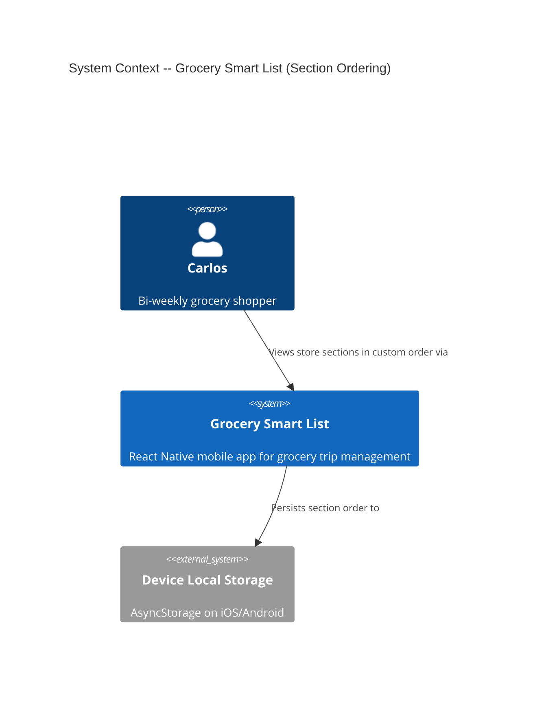
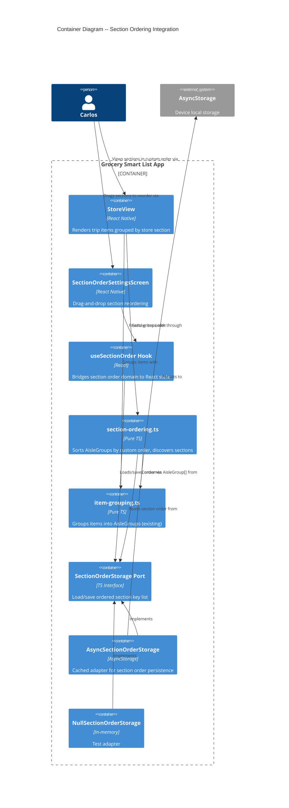

# Architecture Design: Store Section Ordering

**Feature ID**: store-section-order
**Date**: 2026-03-22

---

## System Context

This feature adds custom section ordering to the grocery-smart-list app. Carlos wants store view sections to match his physical walking path instead of the default sort (numbered aisles ascending, then named sections alphabetically).

The feature integrates into the existing ports-and-adapters architecture with zero changes to existing domain types or storage ports.

---

## C4 System Context (L1)



## C4 Container (L2)



---

## Integration Strategy: Custom Order as Sort Override

### Core Principle: Composition, Not Modification

The existing `groupByAisle` function is NOT modified. Instead, a new pure function in a new module (`section-ordering.ts`) accepts `AisleGroup[]` (output of `groupByAisle`) and an optional section order, then returns the groups re-sorted.

This follows the composition pattern:

```
items -> groupByAisle(items) -> sortByCustomOrder(groups, sectionOrder) -> AisleGroup[]
```

When no custom order exists (`null` or empty), the groups pass through unchanged (preserving the default `compareAisleGroups` sort from `groupByAisle`).

### Section Key Consistency

The section key is `${section}::${aisleNumber}` -- the same composite key already computed by `groupKey` in `item-grouping.ts`. The `groupKey` function should be exported (currently module-private) so that `section-ordering.ts` can derive keys from `AisleGroup` without reimplementing the logic.

Alternatively, `section-ordering.ts` derives the key from `AisleGroup.section` and `AisleGroup.aisleNumber` directly. Since `AisleGroup` already carries these fields, a simple key derivation function in `section-ordering.ts` avoids coupling to `item-grouping.ts` internals. Either approach is acceptable; the crafter decides.

### Custom Sort Algorithm

Given:
- `sectionOrder: string[]` -- ordered list of section keys (e.g., `["Health & Beauty::null", "Deli::null", "Dairy::3", ...]`)
- `groups: AisleGroup[]` -- output of `groupByAisle`

Behavior:
1. For each group, compute its section key
2. Find the key's index in `sectionOrder`
3. Groups whose key appears in `sectionOrder` sort by their index position
4. Groups whose key does NOT appear in `sectionOrder` (new/unknown sections) sort to the end, using the default `compareAisleGroups` among themselves
5. Return the re-sorted `AisleGroup[]`

This ensures backward compatibility (no custom order = default sort) and graceful handling of new sections before they are formally appended.

### Section Discovery

A pure function `discoverSections` collects all unique section keys from two sources:

1. **Staple library**: all staple items (via `StapleStorage.loadAll()`)
2. **Current trip items**: all trip items (via `TripStorage.loadTrip()`)

The function returns `string[]` of unique section keys. This is used by the settings screen to show the complete list of known sections.

### Auto-Append of New Sections

When `sortByCustomOrder` encounters groups with keys not in `sectionOrder`, those keys should be appended to the stored order. This detection happens at the domain level in `section-ordering.ts` as a pure function:

`appendNewSections(currentOrder: string[], knownKeys: string[]): string[]`

Returns the order with any new keys appended. The hook or StoreView calls this and persists the updated order if it changed.

---

## Data Flow

### Store View Rendering

1. `StoreView` calls `groupByAisle(neededItems)` (unchanged)
2. `StoreView` obtains section order from `useSectionOrder` hook
3. `StoreView` calls `sortByCustomOrder(aisleGroups, sectionOrder)` (new)
4. Renders `AisleSection` components in the returned order

### Settings Screen

1. `SectionOrderSettingsScreen` calls `useSectionOrder` to get current order
2. Calls `discoverSections` to find all known section keys
3. Merges discovered keys with stored order (append new ones)
4. Displays ordered list with drag handles
5. On drag completion, calls `useSectionOrder.saveOrder(newOrder)`
6. Hook persists via `SectionOrderStorage.saveOrder()`

### Section Navigation

1. Navigation logic receives the same sorted `AisleGroup[]` that StoreView renders
2. "Next section" = next group in the array that has unchecked items
3. No separate navigation order needed -- it follows the render order

---

## Storage Design

### Port: SectionOrderStorage

```
SectionOrderStorage {
  loadOrder(): string[] | null    -- null means "no custom order set"
  saveOrder(order: string[]): void
  clearOrder(): void              -- for reset-to-default
}
```

`null` return from `loadOrder` is semantically distinct from `[]` (empty list). `null` means "user has never customized order; use default sort." `[]` would mean "user has an order with zero sections" (which should not occur in practice but is handled gracefully).

### Adapter Pattern

Follows ADR-003 (cached adapters with async initialization):

- **AsyncSectionOrderStorage**: Cached read/write with `initialize()`, same pattern as `AsyncAreaStorage`
- **NullSectionOrderStorage**: In-memory, accepts optional initial order for testing
- **Storage key**: `@grocery/section_order`

### Reset to Default

`clearOrder()` removes the stored order (sets cache to `null`). After clearing, `loadOrder()` returns `null`, and `sortByCustomOrder` passes groups through unchanged (default sort).

---

## Quality Attribute Strategies

| Attribute | Strategy |
|-----------|----------|
| **Maintainability** | New module (`section-ordering.ts`) with pure functions; existing `item-grouping.ts` unchanged |
| **Testability** | All sort/discover/append functions are pure; null adapter for storage; no mocking needed for domain logic |
| **Performance** | Sort is O(n log n) on group count (typically <20 sections); no performance concern. Cached reads per ADR-003 |
| **Reliability** | Graceful fallback: null order = default sort. Unknown sections sort to end. No data loss path |
| **Usability** | Auto-save on drag (D6). Auto-append of new sections (D4). Reset available (US-SSO-05) |

---

## Deployment Architecture

No new deployment concerns. The feature adds:
- One new port interface file
- One new domain module (pure functions)
- Two new adapter files (async + null)
- One new hook
- One new UI screen
- Modifications to `StoreView`, `ServiceProvider`, `useAppInitialization`

All changes are local to the existing React Native app. No new runtime dependencies.
