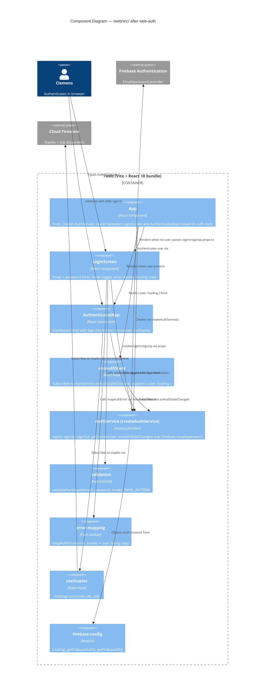

# Application Architecture — web-auth

Scope: `/web/src/` (Vite + React 18 app). Independent of the RN app in `/src/`.

## Context within the broader system

The web app is a **separate container** from the RN app (per `docs/product/architecture/brief.md`). Both share:
- Firebase project `grocery-list-cad` (same Firestore, same Auth user pool)
- Design patterns (factory functions, hexagonal-lite, no classes)

They do NOT share:
- Source code (separate `package.json`, different React versions, different UI primitives)
- Deployment target (RN → EAS; web → Firebase Hosting)
- Runtime (web bundle, no native modules)

This feature adds the **auth port** to the web container, replacing the stale email-link hook.

## C4 Component — Web App (Vite)

## Arrow audit

Every arrow labeled with a verb. Abstraction level is uniform (components inside the web container). External systems (Firebase Auth, Firestore) appear as System_Ext only.

## Data flow — sign-in happy path

1. `<App>` mounts; `createAuthService()` runs once at component scope.
2. `useAuthState(authService)` subscribes to `onAuthStateChanged`; initial state `{ user: null, loading: true }`.
3. First Firebase callback: `{ user: null, loading: false }` (no session). `<App>` renders `<LoginScreen signIn={authService.signIn} signUp={authService.signUp} />`.
4. User types credentials, clicks Sign In. `LoginScreen` calls `validateFormInput` — passes. Sets state `submitting`. Calls `authService.signIn(email, password)`.
5. Firebase returns success. `onAuthStateChanged` fires asynchronously with new user. `useAuthState` updates → `<App>` re-renders → `<AuthenticatedApp>`.
6. `LoginScreen` unmounts during the render swap — its local state is discarded (fine).

## Data flow — sign-in failure path

1. Steps 1-4 identical.
2. `authService.signIn` resolves `{ success: false, error: <firebase message> }`.
3. `LoginScreen` calls `mapAuthError(result.error, 'signIn')` → e.g., "Invalid credentials. Check your password." or "No account found — try Sign Up?"
4. `LoginScreen` transitions to `{ kind: 'error', message }`; form re-enables.

## Data flow — reload persistence

1. Firebase SDK restores session from localStorage on page load.
2. `useAuthState` initial callback delivers `{ user: <restored>, loading: false }`.
3. `<App>` skips `<LoginScreen>` entirely; renders `<AuthenticatedApp>`.

## Sign-out flow (US-07)

1. `<AuthenticatedApp>` has a Sign Out button. On click: `authService.signOut()`.
2. Firebase clears localStorage session; `onAuthStateChanged` fires with `null`.
3. `useAuthState` updates; `<App>` re-renders `<LoginScreen>`.

The `authService` instance is preserved across the sign-out/sign-in cycle (still the same Firebase Auth singleton underneath).

## Acceptance criteria traceability

All AC in `docs/feature/web-auth/discuss/user-stories.md` are observable at component boundaries defined above:

| US | Observable boundary |
|---|---|
| US-01 | AuthService module surface (exported functions, shapes of `AuthResult` and unsubscribe) |
| US-02 | LoginScreen render + `authService.signIn` prop invocation |
| US-03 | LoginScreen mode state + toggle handler |
| US-04 | `validateFormInput` return values; LoginScreen error display without network call |
| US-05 | `mapAuthError` return values; LoginScreen error display after AuthService rejection |
| US-06 | LoginScreen button disabled + label state during submitting |
| US-07 | AuthenticatedApp Sign Out button + `authService.signOut` call + re-render to LoginScreen |

No AC requires private-method introspection; all behavior is visible at component props and DOM.

## Non-goals explicitly excluded

- No CSS / visual polish (D11).
- No routing library (single-screen toggle + conditional render suffices).
- No React context / provider.
- No forgot-password, MFA, OAuth (D10).
- No monorepo / shared auth package (D5 / DD7 / ADR-003).
