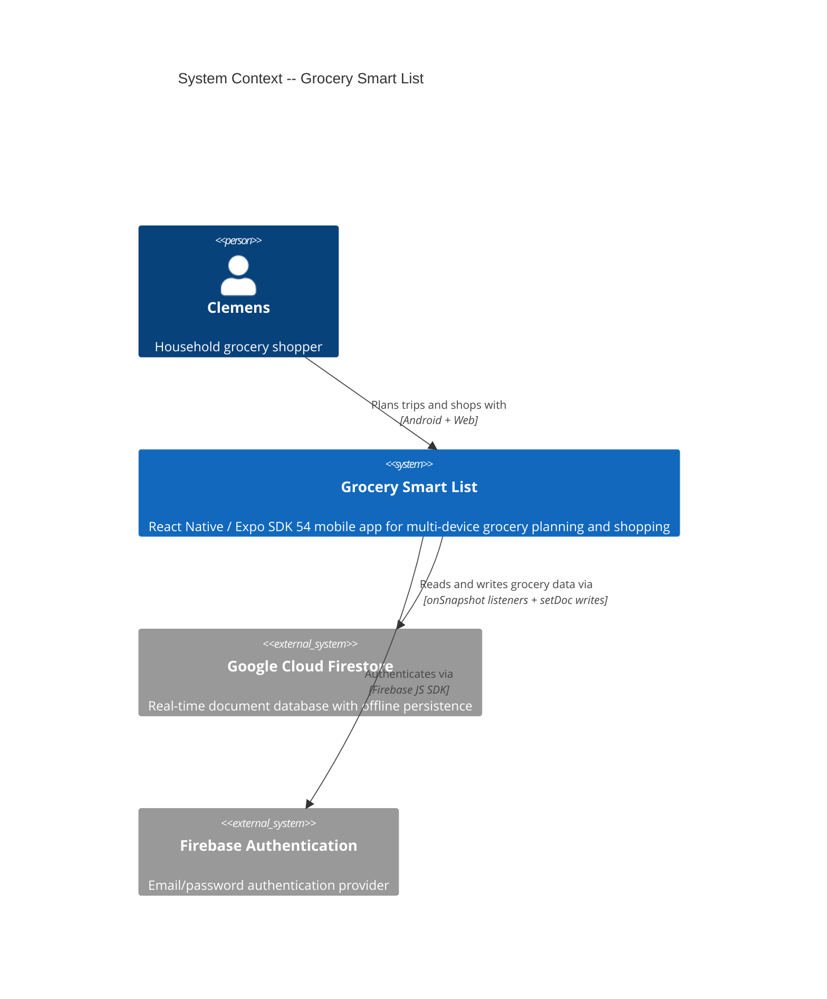
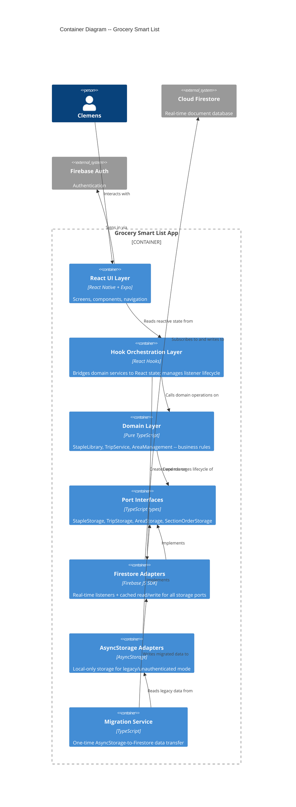
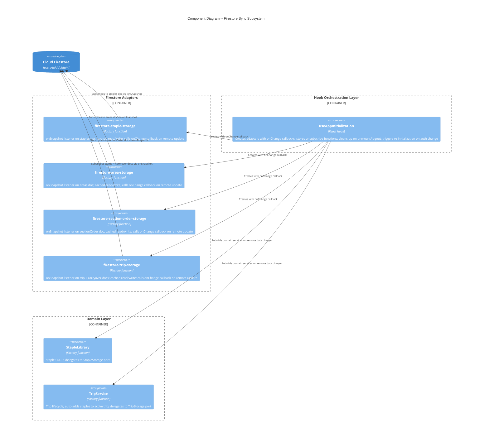
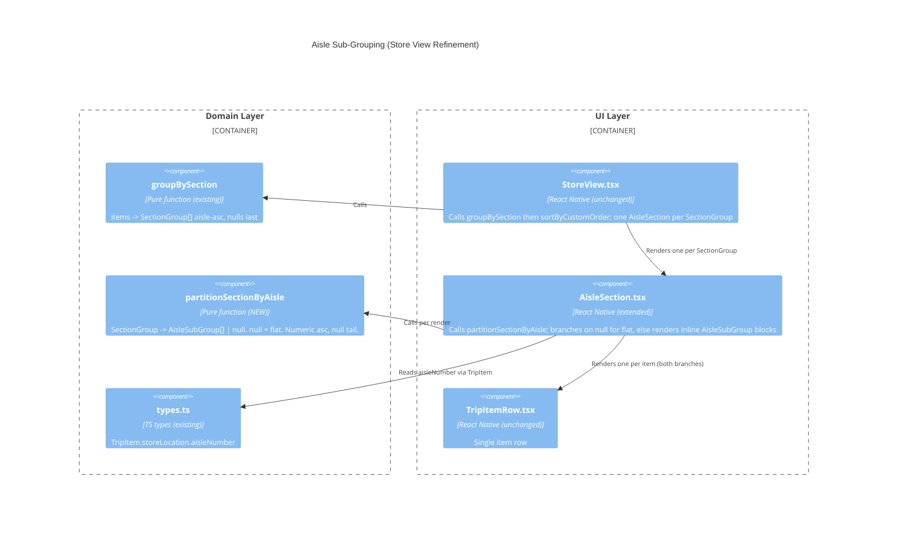
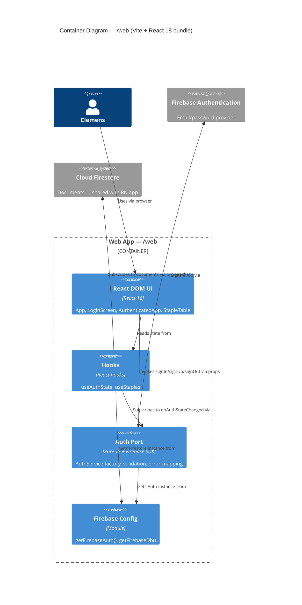
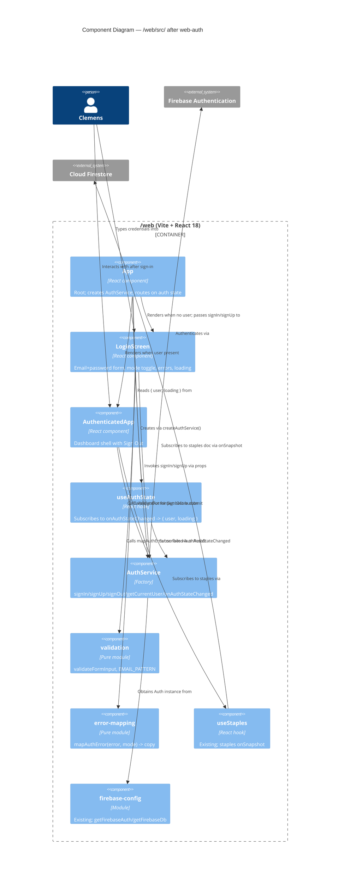

# Architecture Brief: Grocery Smart List

## Application Architecture

### System Context

Grocery Smart List is a React Native / Expo SDK 54 mobile application targeting Android and web. A single authenticated user (Clemens) uses both platforms simultaneously during trip planning, and Android only during shopping. All data is scoped to the authenticated user via Firebase Auth. Firestore is the cloud data store; AsyncStorage provides local fallback for legacy/unauthenticated mode.

### Quality Attributes (Priority Order)

1. **Real-time consistency** -- changes on one device appear on the other within 5 seconds
2. **Fault tolerance** -- sync failures must not block user interaction; local cache remains authoritative for writes
3. **Maintainability** -- hexagonal architecture preserved; new adapters follow existing patterns
4. **Testability** -- domain logic testable without Firestore; adapters testable via port interfaces
5. **Operational simplicity** -- single-user app, no backend services, Firestore handles sync infrastructure

### Constraints

- Team size: 1 developer
- Functional paradigm: factory functions, pure domain functions, hooks (no classes)
- Expo SDK 54 with Firebase JS SDK (not React Native Firebase)
- Existing hexagonal architecture with ports-and-adapters must be preserved
- `persistentLocalCache()` already enabled on Firestore client
- Last-write-wins conflict resolution (single-user app)

### Architectural Style

**Modular monolith with ports-and-adapters (hexagonal)** -- the existing style. No change warranted. Team of 1, single deployment target, infrastructure independence via ports already established.

### C4 System Context (L1)



### C4 Container (L2)



### C4 Component (L3) -- Firestore Sync Subsystem

This subsystem has 5+ components and warrants L3 detail.



### Component Architecture

#### Modified Components

| Component | Current | After | Story |
|-----------|---------|-------|-------|
| `firestore-staple-storage` | `getDoc` at init | `onSnapshot` listener + `onChange` callback | US-01 |
| `firestore-area-storage` | `getDoc` at init | `onSnapshot` listener + `onChange` callback | US-01 |
| `firestore-section-order-storage` | `getDoc` at init | `onSnapshot` listener + `onChange` callback | US-01 |
| `useAppInitialization` | Creates adapters, awaits init | Creates adapters with callbacks, manages unsubscribe lifecycle, re-creates domain services on remote change | US-01, US-04, US-08 |
| `migration.ts` | Migrates staples/areas/sectionOrder | Also migrates trip + carryover | US-06 |
| `AdapterFactories` type | `createTripStorage: () => ...` | `createTripStorage: (uid: string) => ...` (Firestore-backed) | US-02 |

#### New Components

| Component | Responsibility | Story |
|-----------|---------------|-------|
| `firestore-trip-storage` | Firestore adapter for TripStorage port with onSnapshot + cached read/write | US-02, US-03 |

#### Domain-Level Change (US-05)

The orchestration of "new staple auto-adds to active trip" belongs in the hook/orchestration layer, not in the domain. When the staple adapter's `onChange` fires with an updated staple list, the hook compares old vs new staples, creates TripItems for additions, and removes TripItems for deletions. The domain's `TripService` already has `addItem()` and `removeItemByStapleId()`. No new domain types or ports needed.

### Technology Stack

| Technology | Version | License | Rationale |
|------------|---------|---------|-----------|
| React Native | 0.76+ | MIT | Existing; cross-platform mobile |
| Expo SDK | 54 | MIT | Existing; managed workflow |
| Firebase JS SDK | 11.x | Apache 2.0 | Existing; provides `onSnapshot` for real-time listeners |
| TypeScript | 5.x | Apache 2.0 | Existing; strict mode |
| AsyncStorage | 2.x | MIT | Existing; legacy/migration source |

No new technology dependencies required. The `onSnapshot` API is already available in the Firebase JS SDK currently installed.

### Integration Patterns

#### Real-Time Sync Pattern

All four Firestore adapters follow the same pattern:

1. **Subscribe**: `onSnapshot(docRef, callback)` replaces `getDoc(docRef)` during initialization
2. **First callback**: delivers current document state (equivalent to previous `getDoc` behavior)
3. **Subsequent callbacks**: deliver remote changes; adapter updates its internal cache and invokes `onChange` callback
4. **Local writes**: update cache synchronously, call `setDoc` fire-and-forget (unchanged)
5. **Own-write echo**: `onSnapshot` fires for own writes; adapter detects no-change and skips `onChange` callback (compare serialized state)
6. **Cleanup**: `onSnapshot` returns unsubscribe function; stored by init hook and called on unmount/logout

#### onChange Callback Contract

Each Firestore adapter factory accepts an optional `onChange` callback:

- Staple adapter: `onChange: () => void` -- signals that the staple list changed from a remote write
- Area adapter: `onChange: () => void` -- signals that the area list changed from a remote write
- Section order adapter: `onChange: () => void` -- signals that section order changed from a remote write
- Trip adapter: `onChange: () => void` -- signals that trip state changed from a remote write

The callback is intentionally simple (no payload). The hook reads the updated state from the adapter's existing synchronous `loadAll()` / `loadTrip()` methods, then re-creates domain services and triggers React state update.

#### Unsubscribe Lifecycle

Each adapter factory returns an `unsubscribe: () => void` function alongside the storage interface. The init hook collects all unsubscribe functions and calls them:
- On `useEffect` cleanup (component unmount)
- On auth state change (before creating new adapters for new user)
- On explicit logout

#### Trip Migration Pattern (US-06)

Extends existing `migration.ts`:
1. After Firestore trip adapter initializes (first `onSnapshot` delivers current state)
2. If Firestore has no trip document AND AsyncStorage has a trip: write local trip + carryover to Firestore
3. If Firestore already has a trip: use Firestore (cloud wins)
4. Idempotent: re-running migration on an already-migrated user is a no-op

### Quality Attribute Strategies

| Attribute | Strategy |
|-----------|----------|
| Real-time consistency | `onSnapshot` listeners on all 4 document types; <5s propagation via Firestore infrastructure |
| Fault tolerance | Local cache remains authoritative; `setDoc` is fire-and-forget; `persistentLocalCache()` ensures offline writes queue and replay |
| Maintainability | All adapters follow identical factory-function pattern; onChange callback is the only new parameter |
| Testability | Adapters testable via port interfaces; onChange callback testable by invoking it in tests; domain logic unchanged and fully unit-testable |
| No data loss | Migration checks Firestore-empty before writing; cloud-wins when both exist |

### Deployment Architecture

No change. Single Expo app deployed via EAS Build to Android (APK/AAB) and web (static bundle). Firestore is serverless -- no backend to deploy.

### Architecture Enforcement

Style: Hexagonal (Ports and Adapters)
Language: TypeScript
Tool: dependency-cruiser (MIT license, widely adopted, JSON/.dependency-cruiser.js config)

Rules to enforce:
- Domain layer (`src/domain/`) has zero imports from adapters (`src/adapters/`) or hooks (`src/hooks/`)
- Port interfaces (`src/ports/`) have zero imports from adapters or domain
- No adapter-to-adapter dependencies (e.g., Firestore adapter must not import AsyncStorage adapter)
- All dependencies point inward: UI -> hooks -> domain -> ports <- adapters

### External Integrations

| Service | API Type | What We Consume | Contract Test Recommendation |
|---------|----------|-----------------|------------------------------|
| Google Cloud Firestore | Firebase JS SDK (WebSocket + HTTP) | Document read/write, real-time listeners (`onSnapshot`) | Consumer-driven contracts via Pact-JS for Firestore document schema validation. Note: Firestore SDK is a thick client; primary risk is document schema drift, not API contract changes. Schema validation tests (verifying serialized Trip/Staple structure round-trips correctly) provide more value than traditional contract tests here. |
| Firebase Authentication | Firebase JS SDK | Email/password sign-in, auth state observer | Low risk -- standard OAuth/token flow. No custom contract tests needed beyond existing auth integration tests. |

### Handoff to Platform Architect

Contract tests recommended for Firestore document schemas -- the Trip, Staple, Area, and SectionOrder documents are serialized/deserialized across devices. A schema validation test suite should verify that:
- `Trip` objects round-trip through Firestore serialization without data loss
- `StapleItem` objects preserve all fields including `storeLocation` nested structure
- `completedAreas` array survives serialization (currently optional field on Trip)

Development paradigm: **Functional** (factory functions, pure domain functions, React hooks; no classes).

### Aisle Sub-Grouping (Store View Refinement)

**Feature**: `aisle-subgroups-in-store-view` (refines `section-order-by-section` D2). Pure UI refinement + one new pure domain helper. No port, adapter, persistence, or dependency change.

**Design summary**: Add `partitionSectionByAisle(group: SectionGroup): AisleSubGroup[] | null` to `src/domain/item-grouping.ts`. `null` means render flat (single-aisle, all-null, or empty). Otherwise: numeric-asc sub-groups followed by an optional `null`-keyed tail (`No aisle`). `AisleSection.tsx` consumes the helper and branches: flat path preserves today's render exactly; sub-grouped path renders inline AisleSubGroup blocks (divider + badge + per-aisle progress + items). Section-level header (text, X of Y, ✓) is identical on both branches → no regression in section behaviour.

#### Reuse Analysis

| Existing artifact | Decision | Rationale |
|---|---|---|
| `groupBySection` (item-grouping.ts) | EXTEND via composition | New helper consumes its output; signature unchanged |
| `compareItemsInSection` | REUSE as-is | Already enforces aisle-asc + null-last + stable input order |
| `SectionGroup` shape `{ section, items, totalCount, checkedCount }` | MIRROR in `AisleSubGroup` `{ aisleKey, items, totalCount, checkedCount }` | Symmetric aggregate semantics |
| `AisleSection.tsx` | EXTEND in place | New body branch; no new top-level component file |
| `TripItemRow` | REUSE | Item rendering unchanged |
| `StoreView.tsx` | NO CHANGE | Continues to pass `SectionGroup` to `AisleSection` |

#### Partition Helper Shape

```ts
export type AisleKey = number | null; // null sentinel === "no aisle" tail
export type AisleSubGroup = {
  readonly aisleKey: AisleKey;
  readonly items: TripItem[];
  readonly totalCount: number;
  readonly checkedCount: number;
};
export const partitionSectionByAisle =
  (group: SectionGroup): AisleSubGroup[] | null;
```

`null` return is the single source of truth for "flat render" (US-01 collapse rules: empty, all-null, or single distinct aisle).

#### C4 Component (L3) — Touched Code Only



Dependency direction unchanged: UI -> domain. `dependency-cruiser` rules continue to hold.

#### Related ADR

- ADR-005: Aisle Sub-Grouping Belongs in the Domain, Composing on `groupBySection`.

---

## Web App (Vite) Application Architecture

The web app in `/web/` is a **separate container** from the RN app documented above. It is a Vite + React 18 bundle deployed to Firebase Hosting at `https://grocery-list-cad.web.app`. It shares the Firebase project `grocery-list-cad` (same Firestore documents, same Auth user pool) but not the source code, `package.json`, or build tooling.

### Relationship to the RN app

| Dimension | RN app (`/src`) | Web app (`/web/src`) |
|---|---|---|
| Framework | React Native + Expo SDK 54, React 19 | React DOM 18 + Vite 6 |
| Deployment | EAS Build → Android | Firebase Hosting → static bundle |
| Auth pattern | Factory `createAuthService()` + `src/ui/LoginScreen.tsx` | Factory `createAuthService()` + `/web/src/components/LoginScreen.tsx` (mirrored, not shared — see ADR-003) |
| Firestore access | Full hexagonal ports (4 adapters) | Direct hook (`useStaples`) — simpler; may evolve |
| State of this section | Stable | Adds email/password auth via feature `web-auth` (2026-04-14) |

No code is shared between the two apps. Shared is only the **Firebase project** and **document schemas** (Trip, Staple, Area, SectionOrder).

### Web quality attributes

1. **Functional suitability** — sign-in/sign-up work; session persists across reloads
2. **Maintainability** — same factory + pure-module shape as mobile, so a developer familiar with one recognises the other
3. **Testability** — AuthService stays React-free; validation + error-mapping are pure modules
4. **Security** — Firebase SDK handles token storage; client validation is non-authoritative

### Web architectural style

Hexagonal-lite: Firebase Auth SDK sits behind a port (`AuthService`), UI code consumes the port via a thin hook (`useAuthState`) or props (`LoginScreen`). Component tree is 2 nodes deep so React Context is unjustified — props + a module-scoped factory are sufficient.

### C4 Container (L2) — Web App



### C4 Component (L3) — Web App after web-auth



### Web technology stack

| Technology | Version | License | Rationale |
|---|---|---|---|
| React | 18.x | MIT | Existing in `/web/package.json`; stable |
| Vite | 6.x | MIT | Existing; fast dev server, static bundle |
| TypeScript | 5.x | Apache 2.0 | Existing; strict mode |
| Firebase JS SDK | 11.x | Apache 2.0 | Existing; `firebase/auth` already in deps |

No new dependencies for this feature.

### Web architecture enforcement

Style: Hexagonal-lite.
Language: TypeScript.
Tool: **dependency-cruiser** (same tool family as RN side).

Rules to enforce in `/web`:
- `/web/src/components/**` must not import from `firebase/auth` directly (only via `/web/src/auth/`)
- `/web/src/hooks/**` must not import from `firebase/auth` directly (only via `/web/src/auth/`)
- `/web/src/auth/validation.ts` must not import from React or `firebase/**` (pure)
- `/web/src/auth/error-mapping.ts` must not import from React or `firebase/**` (pure)

### Web external integrations

| Service | API Type | What We Consume | Contract Test Recommendation |
|---|---|---|---|
| Firebase Authentication | Firebase JS SDK | `signInWithEmailAndPassword`, `createUserWithEmailAndPassword`, `signOut`, `onAuthStateChanged` | Low risk — standard versioned SDK. No custom contract tests needed. Acceptance tests at the LoginScreen level cover the observable behavior. |
| Google Cloud Firestore | Firebase JS SDK | Document reads via `onSnapshot` on `users/{uid}/data/staples` | Covered under the RN-side assessment (schema drift risk; same documents) |

### Related ADRs

- ADR-003: Web Email/Password Auth — Mirror Mobile, Not Monorepo

